## Containerized Web Application with PostgreSQL using Docker Compose and IPvlan
Project Assignment 1
Containerization and DevOps

This project demonstrates a containerized web application architecture using Docker.

The backend service is implemented using Node.js and Express, while PostgreSQL is used as the database. Both services are containerized and orchestrated using Docker Compose.

Networking is implemented using IPvlan, which assigns static IP addresses to containers inside a defined subnet.

<hr>

<h4 align="center"> Pre-requisite </h4>

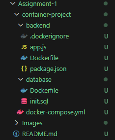

<hr>

**Step-1:-This command verifies that Docker and Docker Compose are successfully installed on the system. The output shows the installed versions, confirming that the Docker environment is ready for containerized application deployment**
```bash
docker --version
docker compose version
```
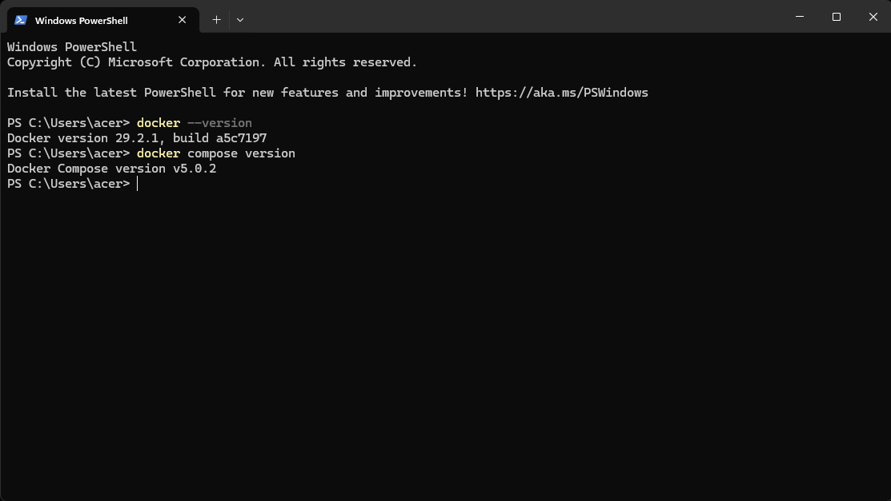


**Step-2:- A new directory named container-project is created to store all project files related to the Dockerized application. The working directory is then changed to this folder to organize the project structure.**
```bash
mkdir container-project
cd container-project
```
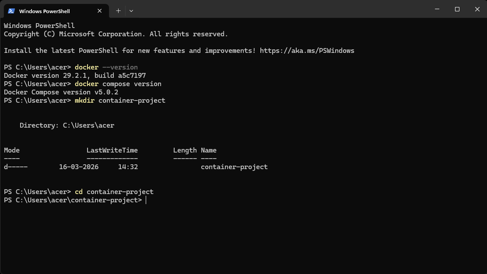


**Step-3:-Separate directories for the backend service and the database configuration are created. This helps maintain a clean project structure where application code and database initialization files are stored independently**
```bash
mkdir backend
mkdir database
```
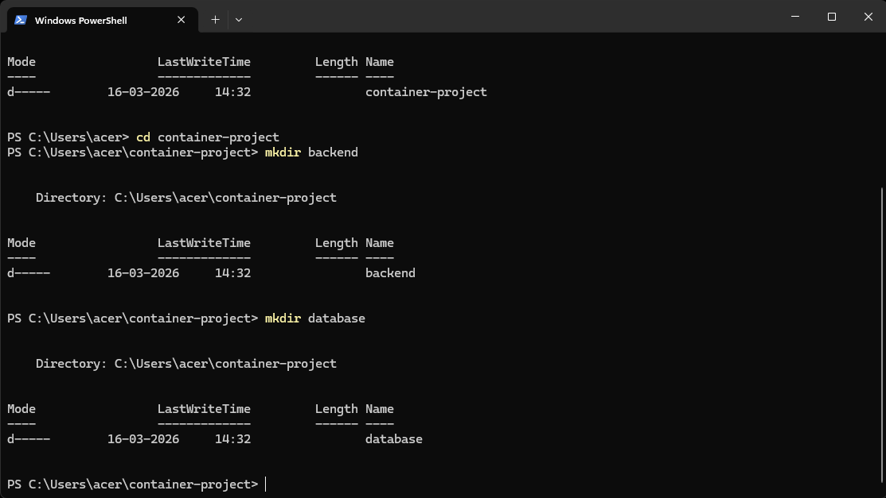


**Step-4:-The ls command lists the contents of the current directory. The output confirms that the project contains the backend and database folders, which will store the application source code and database setup files**
```bash
ls
```
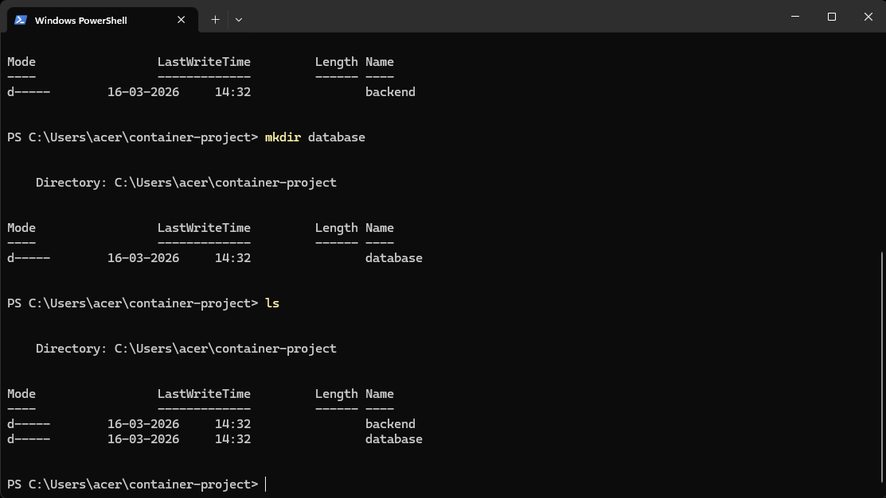


**Step-5:-This command builds and starts all containers defined in the docker-compose.yml file. During the build process, Docker installs dependencies and prepares the backend and database containers required for the application**
```bash
docker compose up --build
```
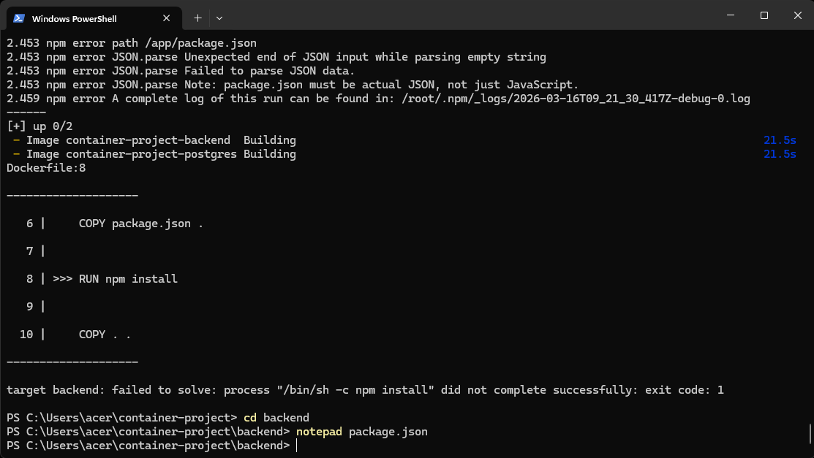


**Step-6:-While building the backend container, Docker attempted to install Node.js dependencies using npm install. The build failed because the package.json file contained invalid or incomplete JSON, which prevented Docker from completing the dependency installation step**
```bash
docker compose up --build
```


**Step-7:-Inside the backend directory, the required application files were created including app.js, package.json, Dockerfile, and .dockerignore. These files are necessary for defining the Node.js application and building the backend Docker image.**
``bash
cd backend
New-Item app.js, package.json, Dockerfile, .dockerignore
```
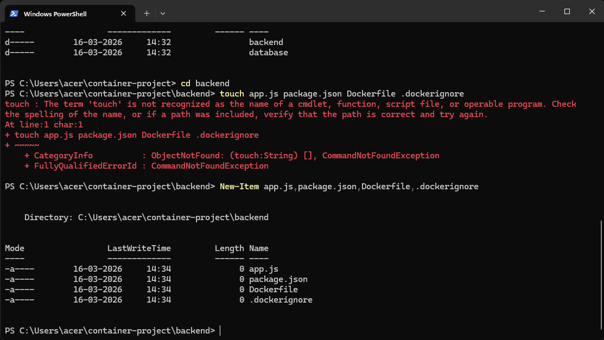


**Step-8:-The dir command lists all files present in the backend directory. The output confirms that the necessary files for the backend service, including the Dockerfile and application source files, were successfully created.**
```bash
dir
```


**Step-9:-The database directory is prepared by creating the Dockerfile and init.sql files. The Dockerfile defines the PostgreSQL container configuration, while the initialization script (init.sql) is used to create the required database tables when the container starts.**
```bash
cd database
New-Item Dockerfile
New-Item init.sql
```
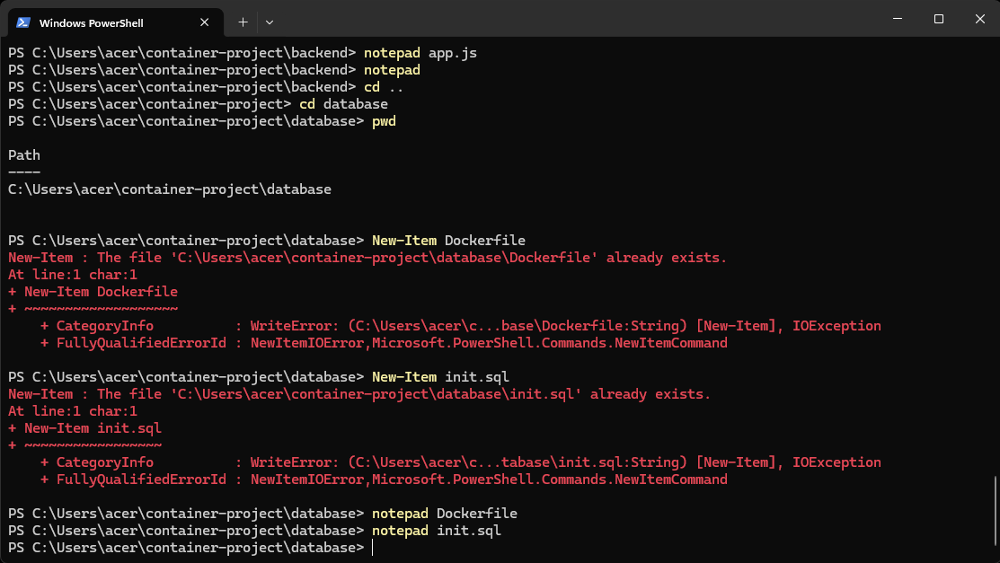


**Step-10:-The database configuration files were opened using a text editor to add the required PostgreSQL setup instructions. These files define the database initialization process and ensure the required tables are automatically created when the container starts**
```bash
notepad Dockerfile
notepad init.sql
```


**Step-11:-The docker-compose.yml file defines the services used in the project, including the backend and PostgreSQL database containers. It also specifies container networking, static IP addresses, and persistent storage using Docker volumes.**
```bash
docker-compose.yml
```
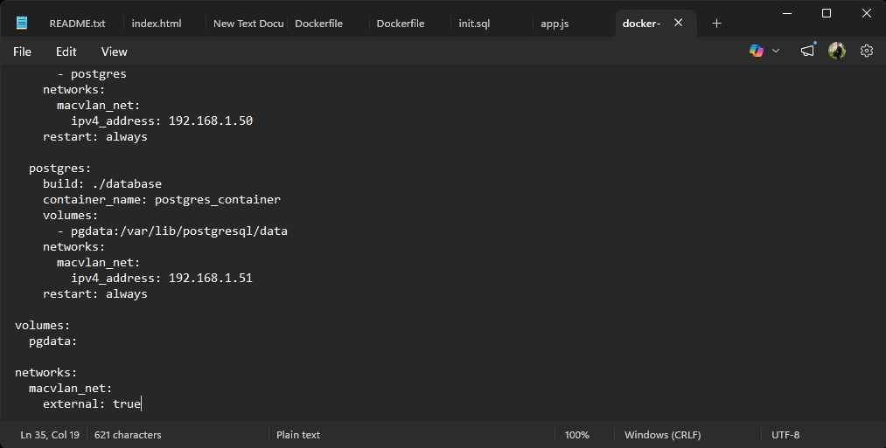


**Step-12:-The Dockerfile for the database container uses the postgres:15-alpine base image and sets environment variables such as database name, user, and password. It also copies the init.sql file to automatically initialize the database when the container starts.**
```bash
Dockerfile
```
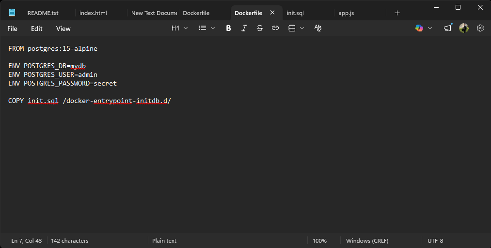


**Step-13:-The backend application is implemented using Node.js and Express. It provides API endpoints to insert user data into the PostgreSQL database and retrieve stored records through HTTP requests
```bash
app.js
```
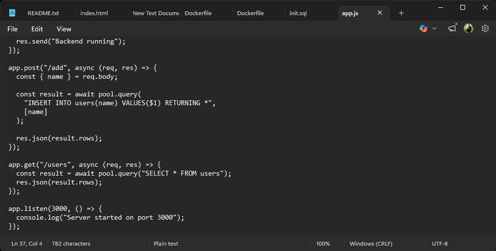


**Step-14:-The init.sql file contains SQL commands used to create the users table when the PostgreSQL container starts. This ensures the required database structure is automatically initialized during container deployment**
```bash
init.sql
```
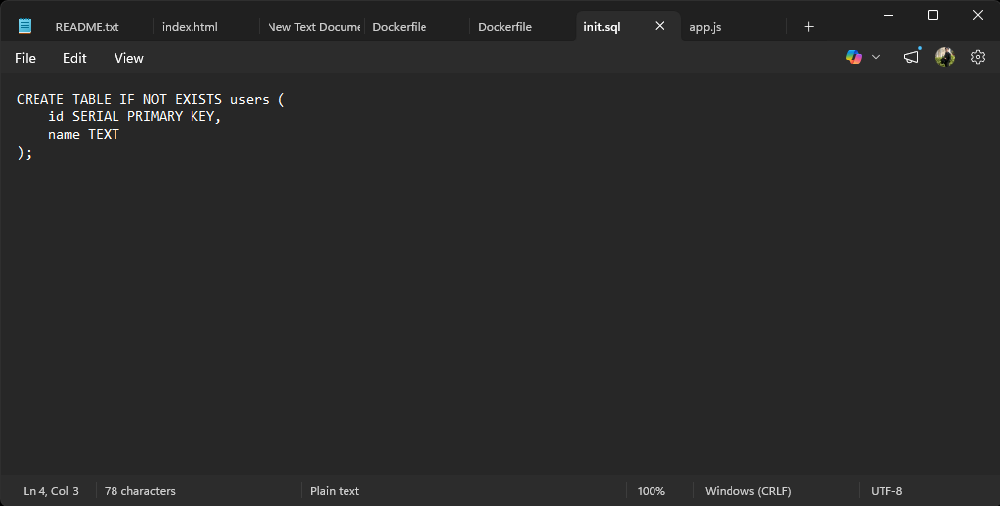


**Step-15:-This command creates the essential backend files required for the Node.js application and Docker image configuration. These files define the application logic, dependency management, and Docker build instructions.**
```bash
cd backend
New-Item app.js, package.json, Dockerfile, .dockerignore
```


**Step-16:- The command attempts to create essential backend files such as app.js, package.json, Dockerfile, and .dockerignore. Since PowerShell does not support the touch command, an alternative method is used to create the files.**
```bash
cd backend
touch app.js package.json Dockerfile .dockerignore
```


**Step-17:-The New-Item command is used in PowerShell to create multiple files required for the Node.js backend application and Docker configuration..
```bash
New-Item app.js, package.json, Dockerfile, .dockerignore
```
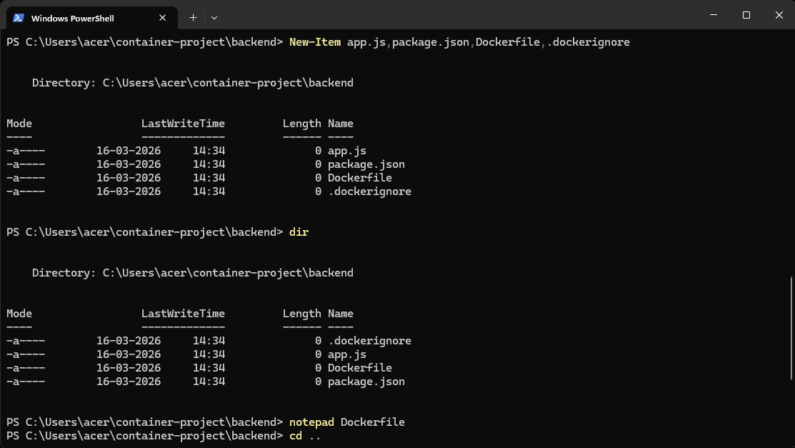


**Step-18:-The dir command lists the files inside the backend directory to verify that app.js, package.json, Dockerfile, and .dockerignore were successfully created.**
```bash
dir
```


**Step-19:-The Dockerfile is opened using Notepad to define the instructions for building the backend container image, including copying application files and installing dependencies.**
```bash
notepad Dockerfile
```
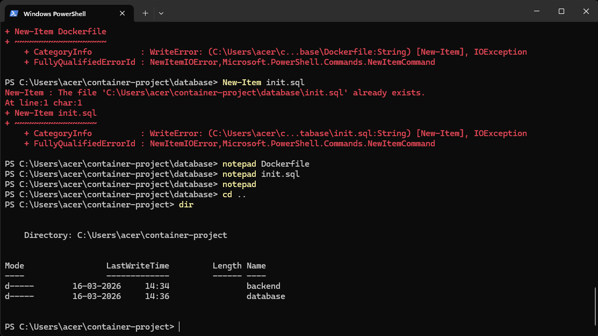


**Step-20:-This command lists the main project directories (backend and database) to confirm that the overall project structure has been created correctly before building the Docker containers.**
```bash
dir
```


**Step-21:-The app.js file contains the backend logic written in Node.js using Express. It defines API endpoints to insert user data into the PostgreSQL database (/add) and retrieve all users (/users) while running the server on port 3000**
```bash
app.js
```


**Step-22:-The docker-compose.yml file defines multiple services including the backend application and PostgreSQL database. It also specifies networking using a macvlan network and assigns static IP addresses to containers.**
```bash
docker-compose.yml
```


**Step-23:-The Dockerfile builds a custom PostgreSQL image using the postgres:15-alpine base image. Environment variables configure the database credentials and the init.sql script is copied to initialize the database automatically
```bash
database/Dockerfile
```


**Step-24:-This command attempts to create a macvlan Docker network with a defined subnet and gateway so containers can receive IP addresses from the local network.
```bash
docker network create -d macvlan \
--subnet=192.168.1.0/24 \
--gateway=192.168.1.1 \
-o parent=Ethernet \
macvlan_net
```


**Step-25:-The ip link command is used to list the available network interfaces in the system. This helps identify the correct parent interface required for creating the Docker macvlan network**
```bash
wsl ip link
```
**Example output**
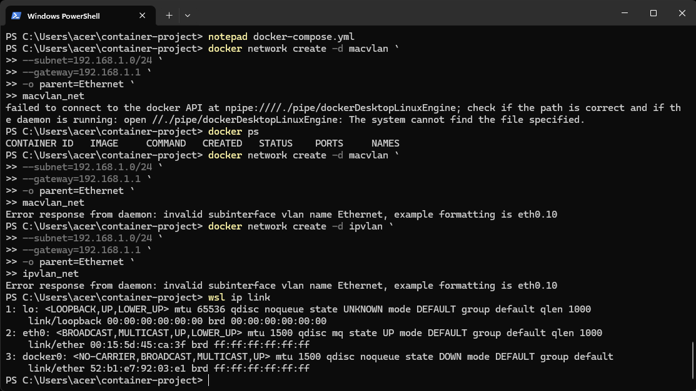

**Step-26:-This command creates a macvlan network that allows Docker containers to obtain IP addresses from the local network. The subnet, gateway, and parent network interface (eth0) are specified
```bash
docker network create -d macvlan \
--subnet=192.168.1.0/24 \
--gateway=192.168.1.1 \
-o parent=eth0 \
macvlan_net
```
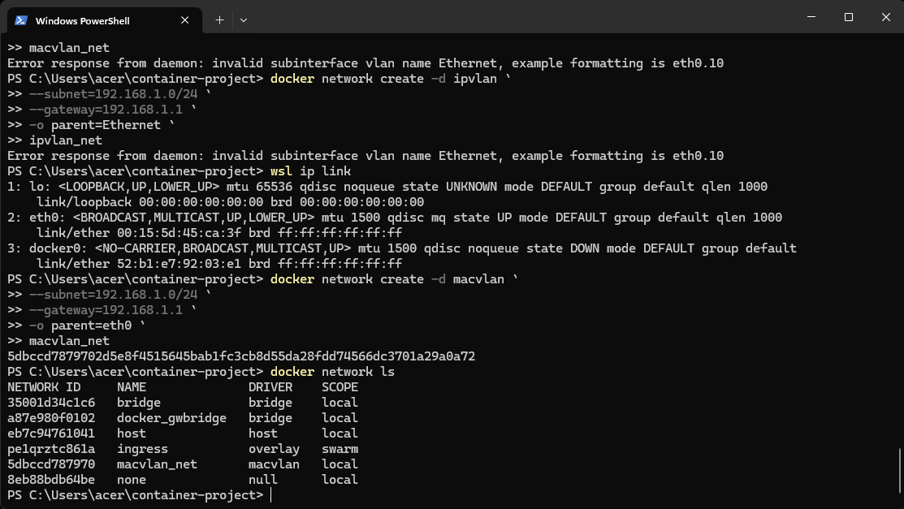

**Step-27:-The docker network ls command displays all Docker networks available on the system, confirming that the newly created macvlan_net network has been successfully created.
```bash
docker network ls 
```
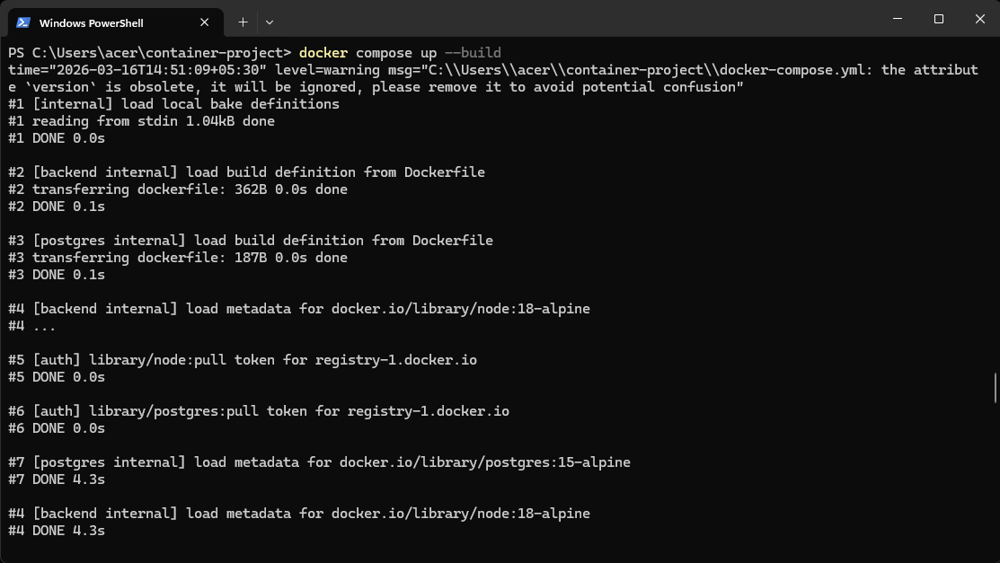

**Step-28:-This command builds Docker images for the backend and PostgreSQL services and starts the containers defined in the docker-compose.yml file.**
```bash
docker compose up--build
```
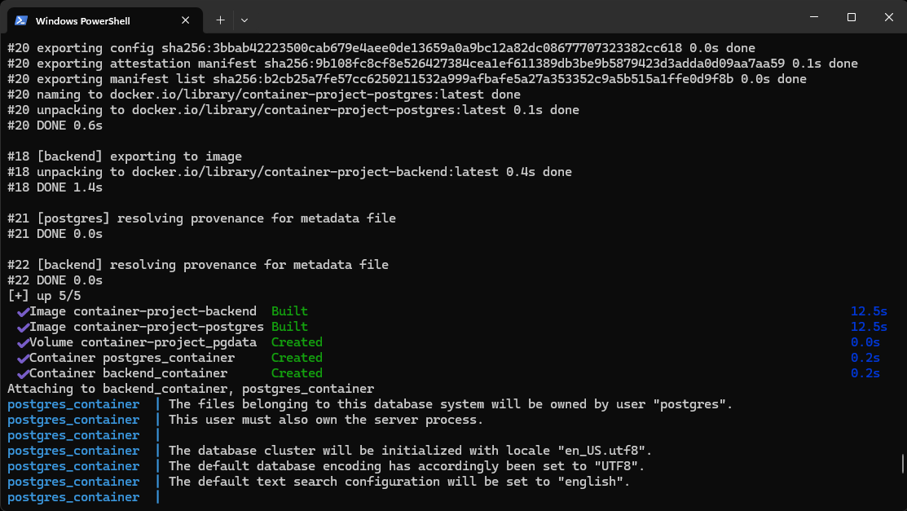
**Step-29:-The docker ps command lists all currently running containers, verifying that the backend and PostgreSQL containers are running successfully
```bash
docker ps
```
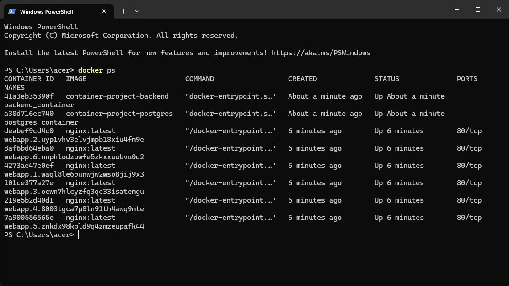

**Step-30:-This command sends a request to the backend server running on port 3000 to check if the API is working properly. The response confirms that the backend service is running successfully.
```bash
curl.exe http://localhost:3000/health
```
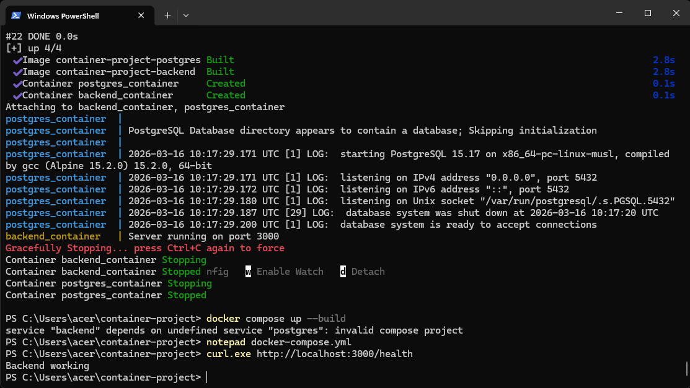

**Step-31:-This command sends a POST request to the backend API to insert a new user into the PostgreSQL database. The response confirms that the record with name Varun was successfully inserted
```bash
Invoke-RestMethod -Uri http://localhost:3000/add -Method POST -ContentType "application/json" -Body '{"name":"Varun"}'
```
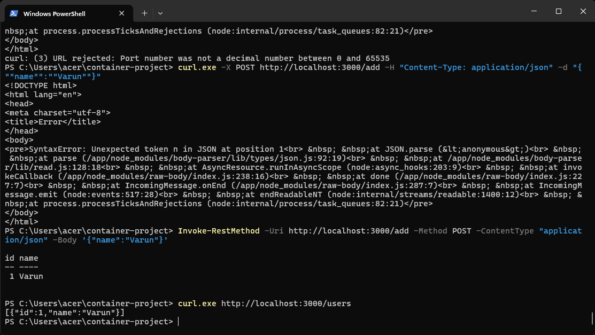

**Step-32:-This command sends a GET request to retrieve all user records stored in the PostgreSQL database through the backend API. The output shows the inserted user data in JSON format..
```bash
curl.exe http://localhost:3000/users
```
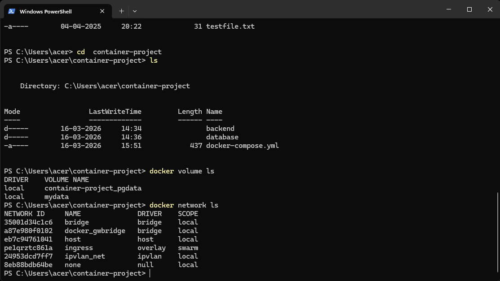

**Step-33:-The ls command lists the contents of the project directory, confirming that the backend, database, and docker-compose.yml files are present.
```bash
ls
```
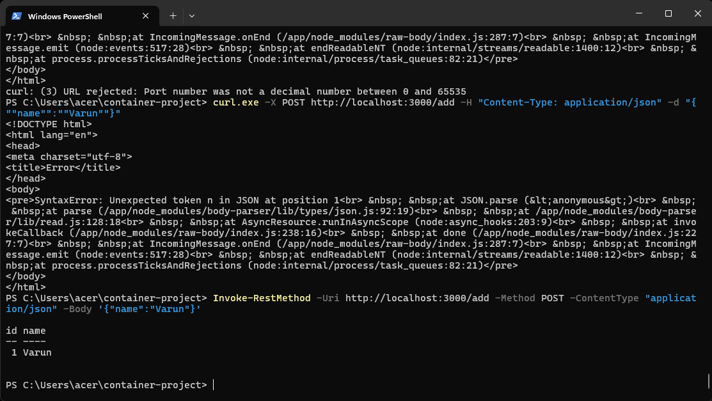
<hr>

<h4 align="center"> Report </h4>

<hr>


**_Build Optimization Explanation_**

While building the Docker images for this project, several techniques were applied to ensure that the containers remain efficient, lightweight, and secure.

One important optimization used in the backend container is the use of a lightweight base image node:18-alpine. Alpine Linux is significantly smaller than standard Linux images, which reduces the Docker image size, improves download speed, and allows containers to start faster.

Another optimization is the separation of services using Docker Compose. The backend application and PostgreSQL database are deployed in separate containers, which improves modularity and makes the system easier to manage, update, and scale independently.

A .dockerignore file is also used in the backend directory. This file prevents unnecessary files such as node_modules, .git, and temporary files from being included in the Docker build context. By excluding these files, the build process becomes faster and the final container image remains clean and optimized.

Additionally, Docker volumes are used for PostgreSQL data storage. The database files are stored in a Docker volume instead of inside the container filesystem, ensuring data persistence even if the container is stopped or removed.

Finally, Docker networking is used to allow communication between the backend and database containers. A custom network is configured so that the Node.js application can securely interact with the PostgreSQL database without exposing the database service directly to the host system.

These optimizations help improve the performance, portability, and reliability of the containerized application.


<br>

**_Network Design Diagram_**

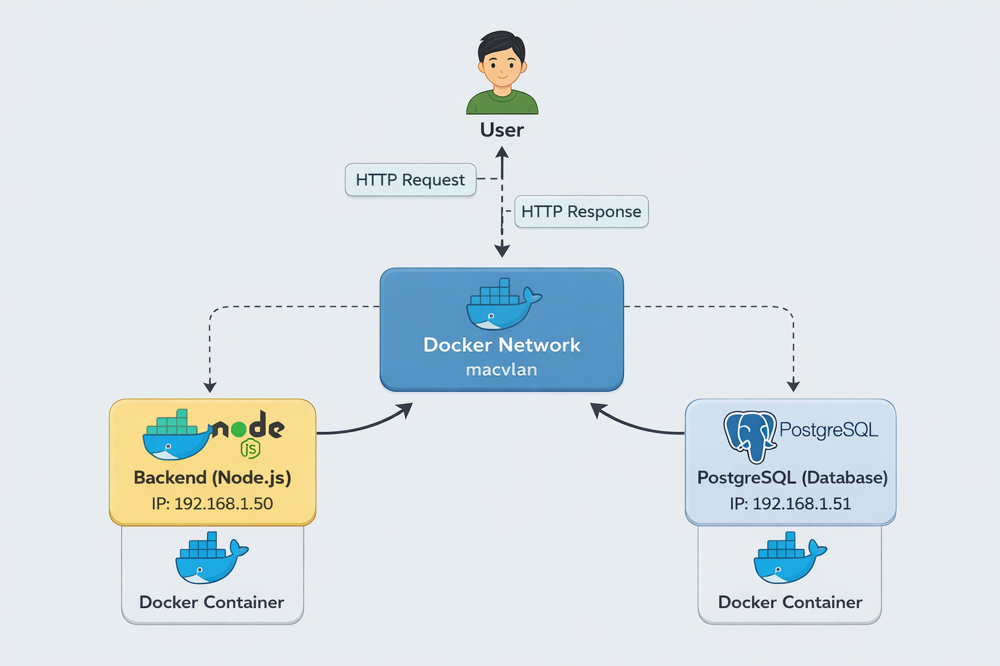


<br>


**_Image Size Comparison_**
The selection of the base image plays an important role in determining the final Docker image size and overall performance of the containerized application.

For Node.js applications, different base images are available:

node:18 → approximately 1.1 GB

node:18-alpine → approximately 180 MB

The Alpine-based image is significantly smaller because it is built on the lightweight Alpine Linux distribution. A smaller base image reduces the storage space required for Docker images, speeds up image downloads, and improves container startup time.

In this project, the node:18-alpine image was used for building the backend container. This helps create a more lightweight and efficient containerized application while maintaining the required Node.js runtime environment


**_Macvlan Vs IPvlan_**

Docker provides different networking drivers that allow containers to communicate with external networks. Two commonly used drivers are Macvlan and IPvlan.

| Feature          | MACVLAN                                                        | IPVLAN                                                  |
| ---------------- | -------------------------------------------------------------- | ------------------------------------------------------- |
| MAC Address      | Each container receives a **unique MAC address**               | Containers share the **host MAC address**               |
| Network Load     | Higher load on network switches due to multiple MAC addresses  | Lower load on switches because MAC addresses are shared |
| Scalability      | Limited by the number of MAC addresses supported by the switch | More scalable for large deployments                     |
| Network Behavior | Containers appear as **separate devices on the network**       | Containers behave more like logical interfaces          |
| Typical Usage    | Small or isolated environments                                 | Large-scale deployments and cloud environments          |
