Below I’ve written the **README.md** for your Kubernetes experiment, based on the screenshots you provided. After that, I’ll give you the matching **Kubernetes/index.html** file (just like the ones that worked earlier) so the page renders beautifully on your site.

---

## 📘 README.md for the Kubernetes folder

Create this file as `Kubernetes/README.md`:

```markdown
# Kubernetes Deployment, Scaling, and Rolling Updates on Docker Desktop

## Aim
To demonstrate basic Kubernetes operations using Docker Desktop’s built‑in Kubernetes cluster – including pod creation, deployments, scaling, service exposure, and rolling updates.

## Pre‑requisites
- Docker Desktop with Kubernetes enabled
- kubectl configured (windows/linux)
- Basic command‑line knowledge

---

## Step‑by‑Step Procedure

**Step 1 – Verify Kubernetes Cluster**  
Check that `kubectl` is working and the local Docker‑Desktop node is ready.

```powershell
kubectl get nodes
```
*The output shows a single node `docker-desktop` in the Ready state.*

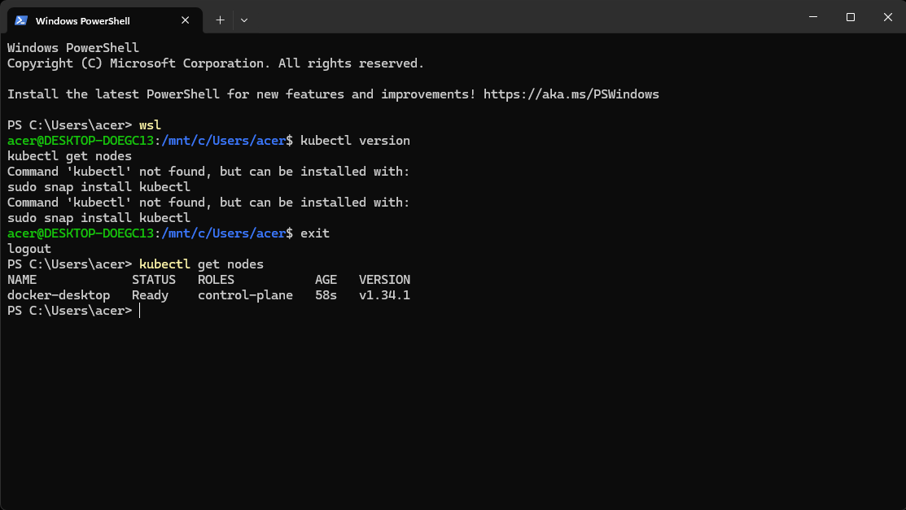

---

**Step 2 – Create a Simple Pod**  
Run a pod using the `httpd` (Apache) image.

```powershell
kubectl run apache-pod --image=httpd
```
*Pod created successfully.*

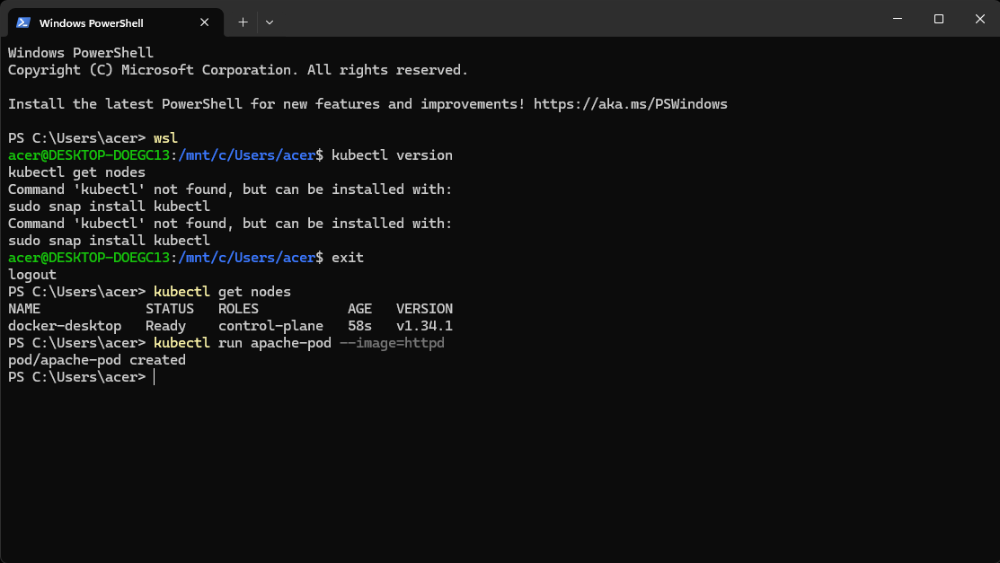

---

**Step 3 – List Running Pods**  
Verify the pod is up and running.

```powershell
kubectl get pods
```
*The pod `apache-pod` is in Running status.*

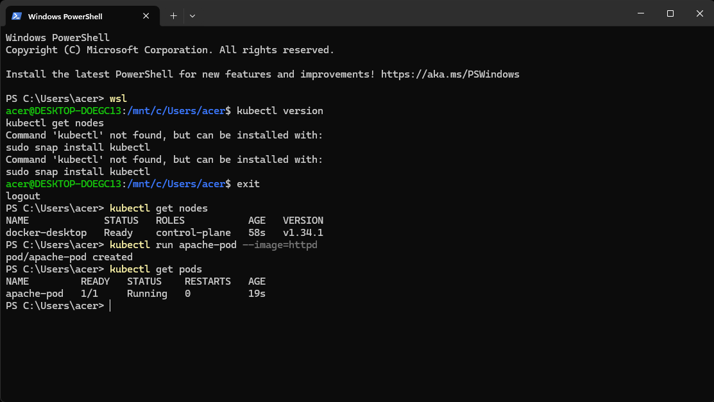

---

**Step 4 – Port‑Forward to the Pod**  
Expose the pod locally so you can access the Apache welcome page.

```powershell
kubectl port-forward pod/apache-pod 9090:80
```
*The terminal shows forwarding from port 9090 to 80.*

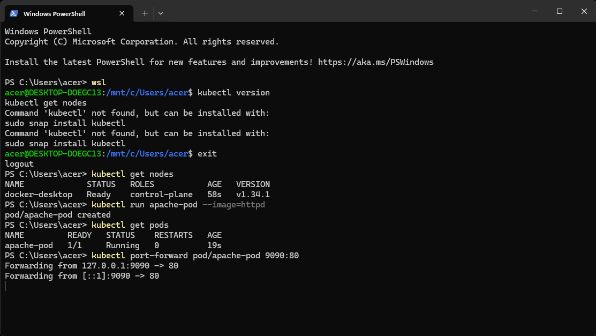

---

**Step 5 – Test the Web Server**  
Open `http://localhost:9090` in a browser – you should see the “It works!” Apache default page.


---

**Step 6 – Delete the Pod**  
Remove the pod after testing.

```powershell
kubectl delete pod apache-pod
```
*The pod is deleted. `kubectl get pods` shows no resources.*

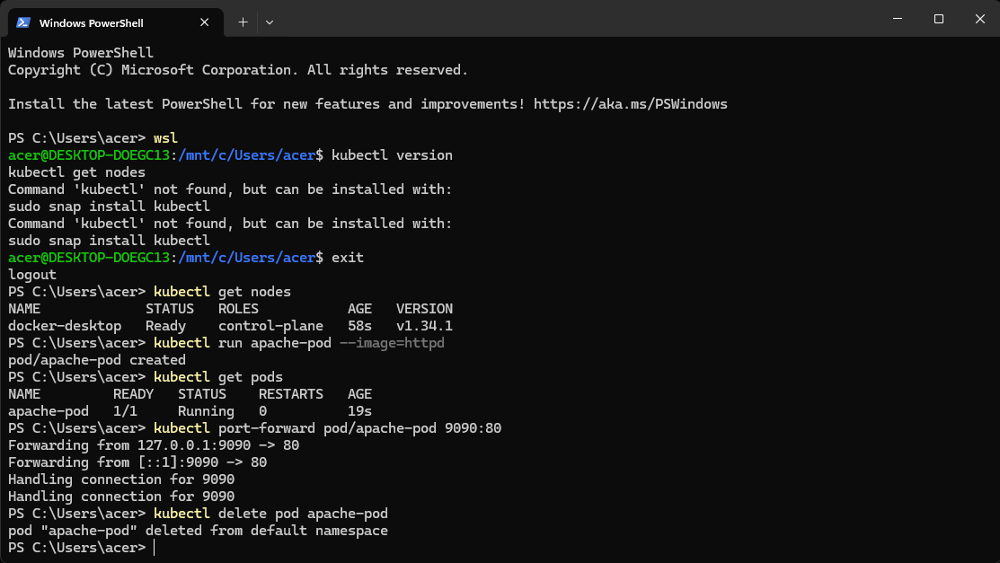

---

**Step 7 – Create a Deployment**  
Deployments manage replica sets and provide resilience. Create one using the `httpd` image.

```powershell
kubectl create deployment apache --image=httpd
```
*Deployment `apache` created.*

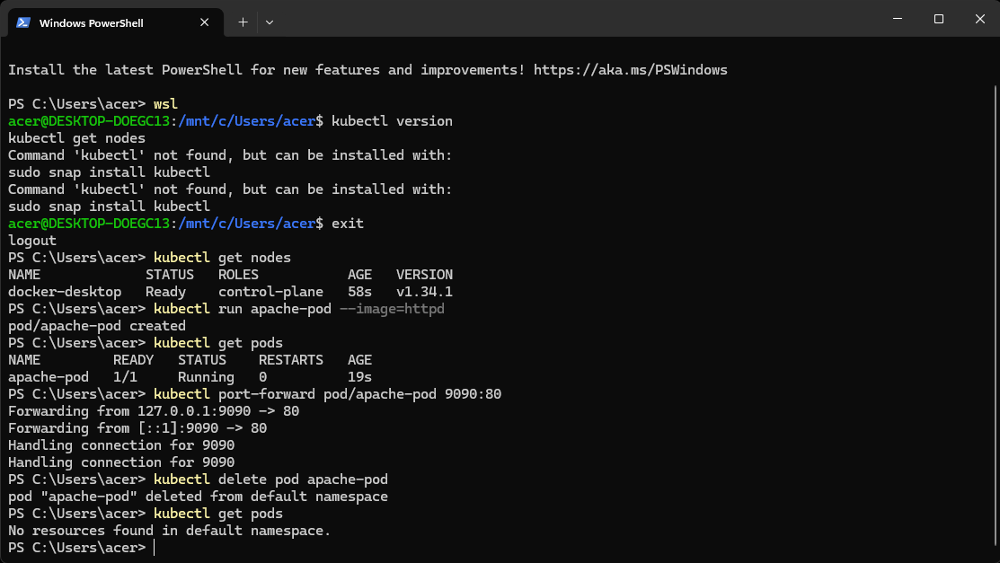

---

**Step 8 – Verify Deployment and Pods**  
Check the status of the deployment and the pod it created.

```powershell
kubectl get deployments
kubectl get pods
```
*One pod is running, and the deployment shows `1/1` ready.*

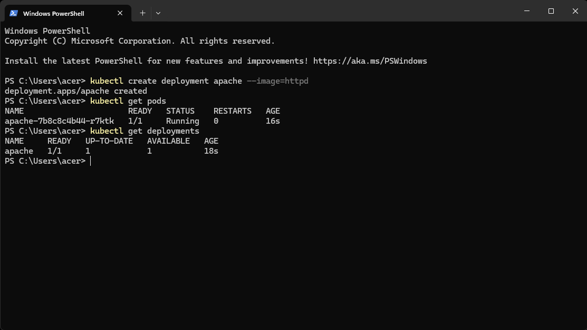

---

**Step 9 – Expose the Deployment as a Service**  
Create a NodePort service to expose the deployment externally.

```powershell
kubectl expose deployment apache --port=80 --type=NodePort
```
*Service `apache` exposed.*

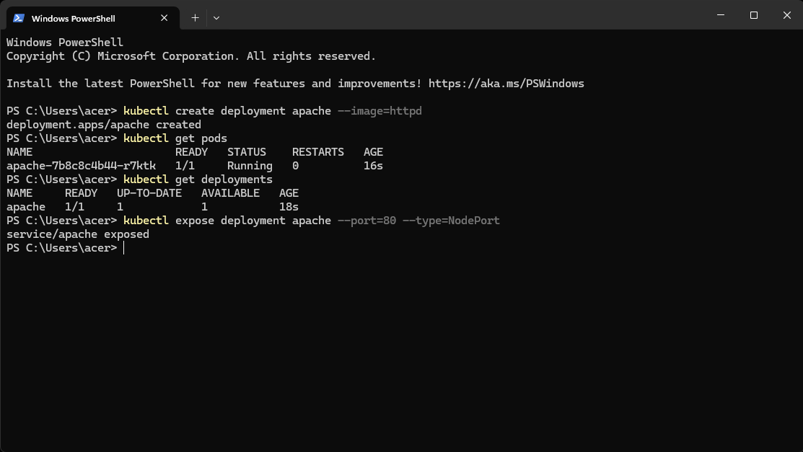

---

**Step 10 – Port‑Forward to the Service**  
Forward a local port to the service to test connectivity.

```powershell
kubectl port-forward service/apache 8082:80
```
*Forwarding from port 8082 to 80.*

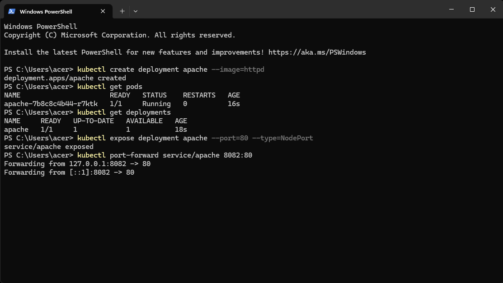

---

**Step 11 – Access the Service via Browser**  
Open `http://localhost:8082` – the Apache page appears again.

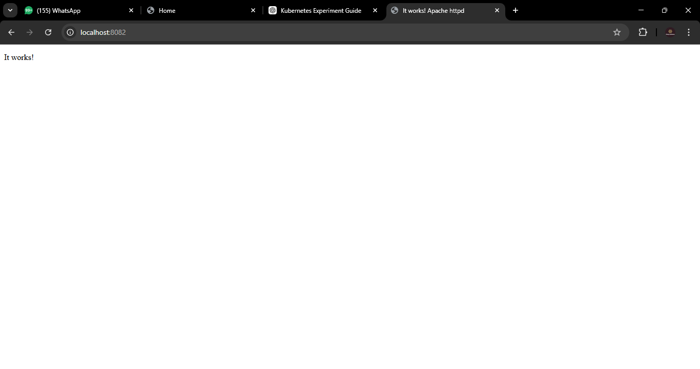

---

**Step 12 – Scale the Deployment**  
Increase the number of pod replicas to 2.

```powershell
kubectl scale deployment apache --replicas=2
```
*Deployment scaled to 2 replicas.*

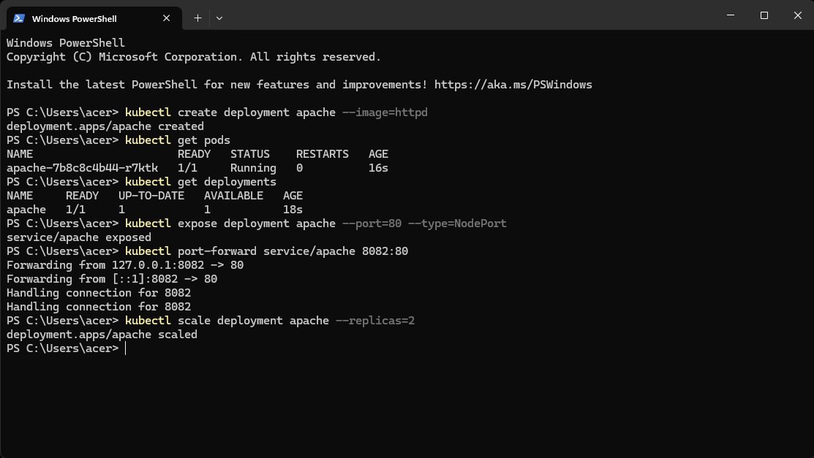

---

**Step 13 – Verify Scaling**  
List pods to see both replicas running.

```powershell
kubectl get pods
```
*Two pods are now shown, both `1/1 Running`.*

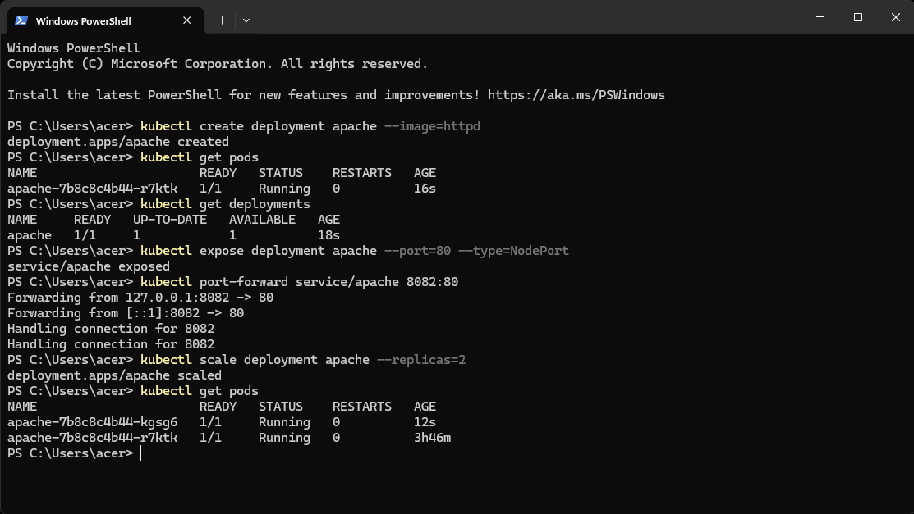

---

**Step 14 – Simulate a Bad Rolling Update**  
Update the image to a non‑existent one (`wrongimage`) to see how Kubernetes handles failures.

```powershell
kubectl set image deployment/apache httpd=wrongimage
```
*A new pod will fail to pull the image and enter `ImagePullBackOff` state.*

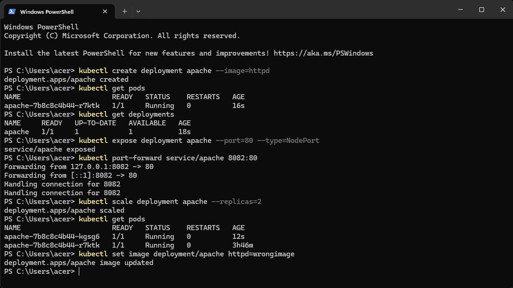

---

**Step 15 – Observe the Failed Update**  
Check pods – the new pod with the wrong image shows status `ImagePullBackOff` while old pods keep running.

```powershell
kubectl get pods
```
*One pod is failing, two old ones are still active.*

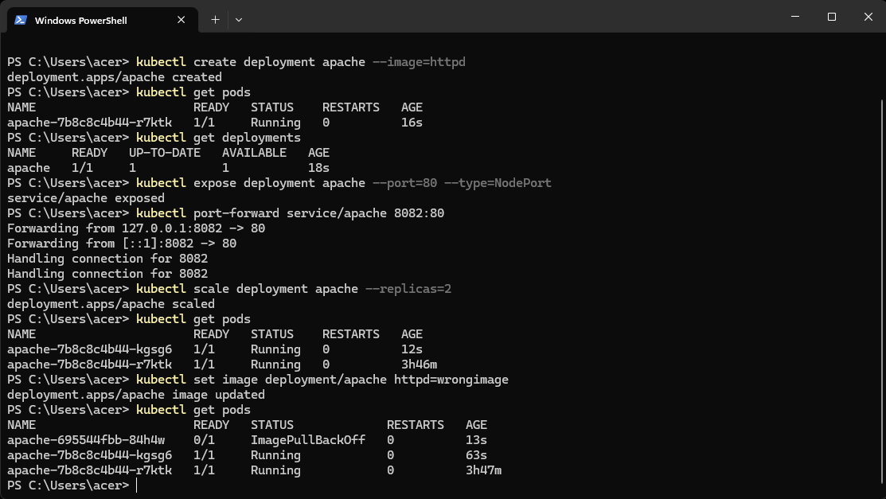

---

**Step 16 – Rollback / Fix the Deployment**  
Revert the image to the correct `httpd` to automatically heal the deployment.

```powershell
kubectl set image deployment/apache httpd=httpd
```
*The deployment is updated; the broken pod is terminated and a new healthy one replaces it.*

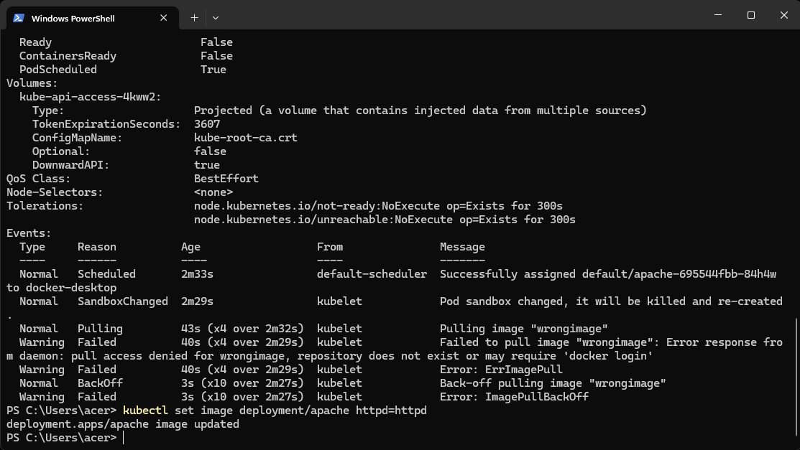

---

**Step 17 – Verify Recovery**  
After the rollback, all pods should be running again.

```powershell
kubectl get pods
```
*Now only the healthy pods remain.*

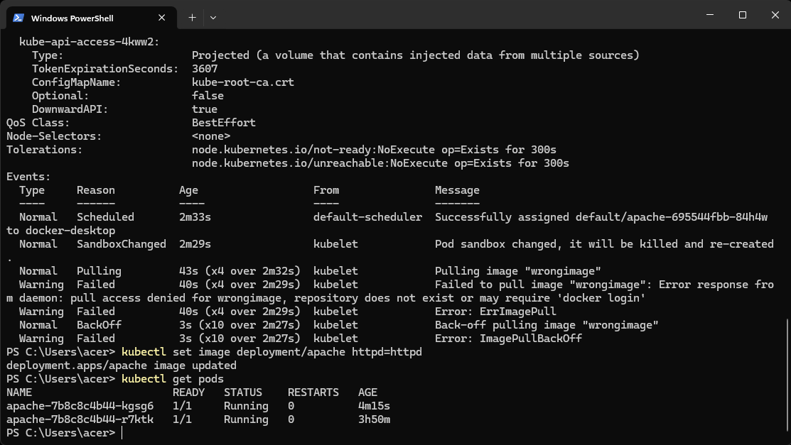

---

**Step 18 – Self‑Healing in Action (Delete a Pod)**  
Delete one pod manually – Kubernetes automatically recreates it to match the desired replica count.

```powershell
kubectl delete pod apache-7b8c8c4b44-kgsg6
kubectl get pods
```
*A new pod (`ContainerCreating` then `Running`) replaces the deleted one.*

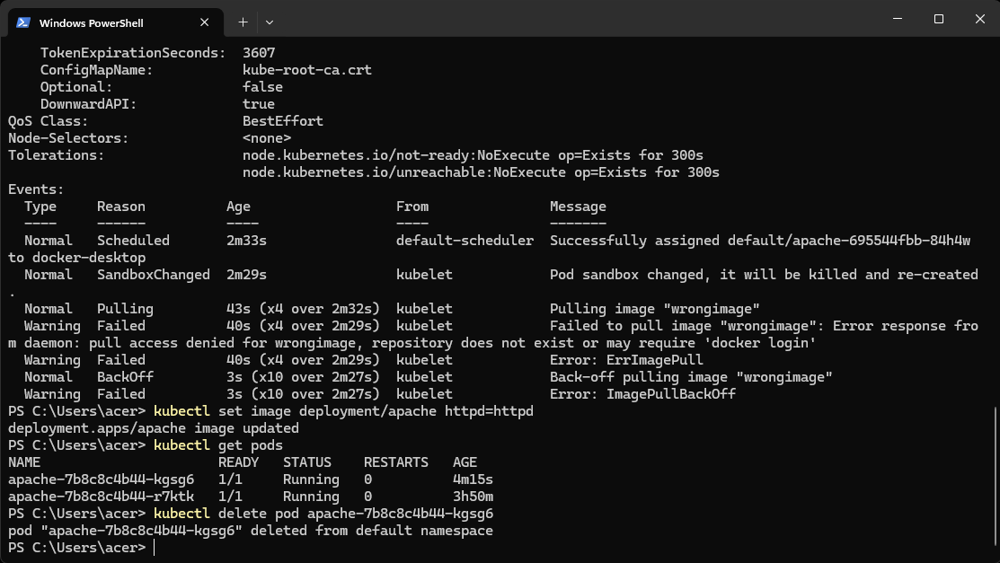

---

**Step 19 – Final Cluster State**  
List all pods one last time – the deployment maintains exactly 2 replicas, all healthy.

```powershell
kubectl get pods
```
*The self‑healing cluster is now stable with the desired state.*

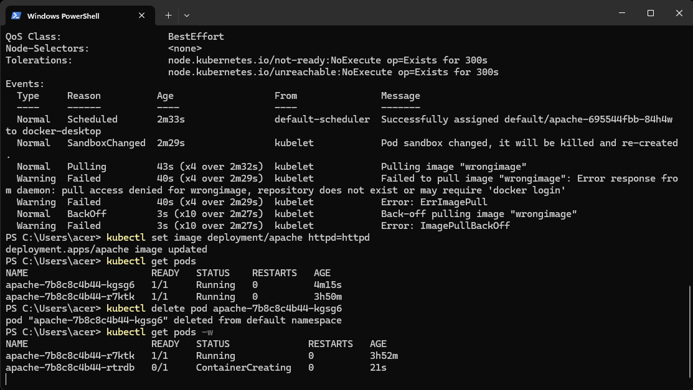

---

## ✅ Key Takeaways
- Kubernetes maintains the **desired state** – if a pod dies, it’s replaced automatically.
- **Deployments** manage replica sets and rolling updates.
- **Services** provide stable network access to dynamic pods.
- **Rolling updates** can be rolled back instantly using `set image`.
- Local Kubernetes on Docker Desktop is a great sandbox for learning without any cloud costs.
```

---

