```markdown
## Lab Experiment 10: SonarQube – Static Code Analysis

### Aim
To set up SonarQube Server and Sonar Scanner using Docker Compose, analyse a sample Java application containing intentional bugs, vulnerabilities, and code smells, and understand how Quality Gates prevent bad code from being deployed.

<hr>

<h4 align="center"> Pre‑requisite </h4>

- Docker and Docker Compose installed
- Java JDK and Maven (already present in the lab environment)
- Docker Hub account (to pull images)
- Basic understanding of Java and Maven

> **Experiment Directory Structure**  
> Contains the Docker Compose file, the sample Java project (`sample-java-app`), and all screenshots.
>
> 

<hr>

### Step‑by‑Step Procedure

---

**Step 1 – Verify Environment (Maven & Docker)**  
Check that Maven is installed and Docker containers are running (previous experiments may still be active).

```powershell
mvn -version
docker ps
```
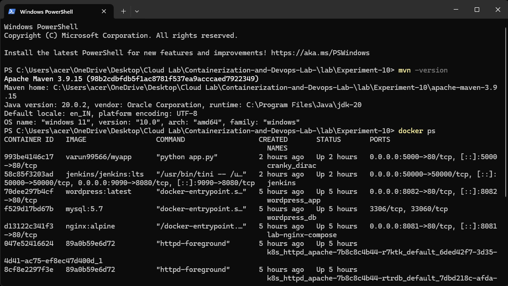

---

**Step 2 – Create the Docker Compose File**  
Create `docker-compose.yml` to define two services:  
- `sonar-db` (PostgreSQL 13)  
- `sonarqube` (SonarQube LTS Community edition)

```powershell
notepad docker-compose.yml
```
*(The file is then filled with the YAML code below.)*

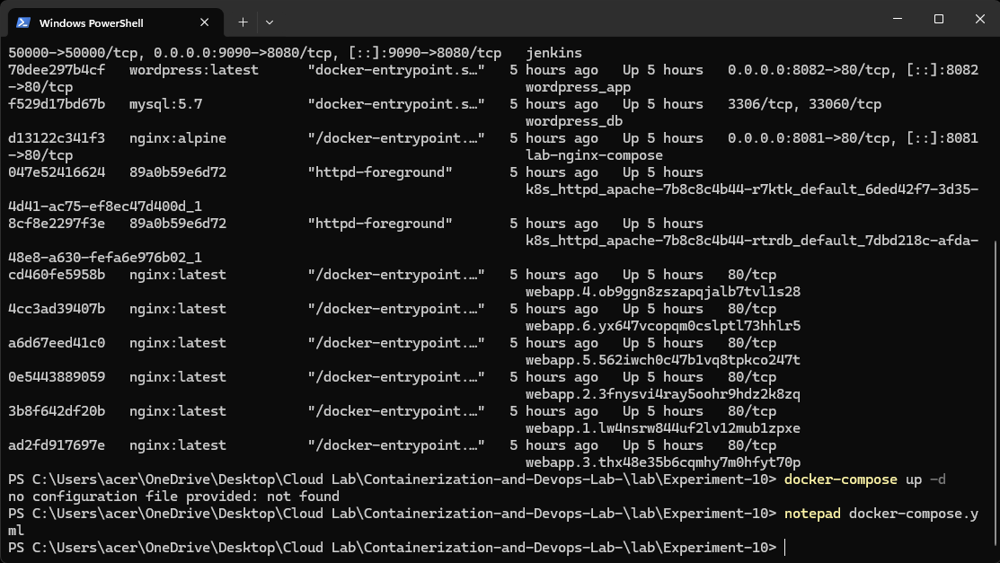

```yaml
version: '3.8'

services:
  sonar-db:
    image: postgres:13
    container_name: sonar-db
    environment:
      POSTGRES_USER: sonar
      POSTGRES_PASSWORD: sonar
      POSTGRES_DB: sonarqube
      POSTGRES_HOST_AUTH_METHOD: trust
    volumes:
      - sonar-db-data:/var/lib/postgresql/data
    networks:
      - sonarqube-lab

  sonarqube:
    image: sonarqube:lts-community
    container_name: sonarqube
    ports:
      - "9000:9000"
    environment:
      SONAR_JDBC_URL: jdbc:postgresql://sonar-db:5432/sonarqube
      SONAR_JDBC_USERNAME: sonar
      SONAR_JDBC_PASSWORD: sonar
    volumes:
      - sonar-data:/opt/sonarqube/data
      - sonar-extensions:/opt/sonarqube/extensions
    depends_on:
      - sonar-db
    networks:
      - sonarqube-lab

volumes:
  sonar-db-data:
  sonar-data:
  sonar-extensions:

networks:
  sonarqube-lab:
    driver: bridge
```

---

**Step 3 – First Start Attempt (Docker Hub Authentication Required)**  
Running `docker-compose up -d` fails because the images cannot be pulled without proper Docker Hub login.

```powershell
docker-compose up -d
```
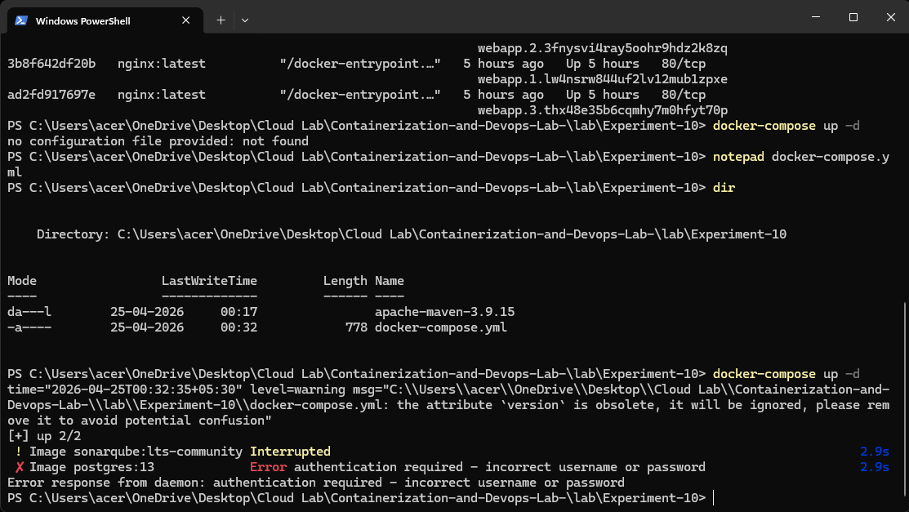

---

**Step 4 – Log in to Docker Hub**  
Use the web‑based login flow to authenticate. A device code is generated; pressing ENTER opens the browser to complete the login.

```powershell
docker login
```
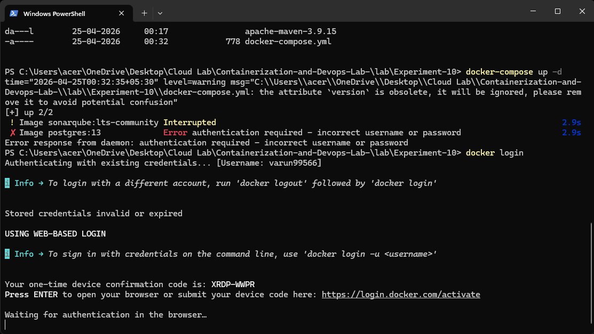

---

**Step 5 – Successful Docker Hub Login**  
Once the browser confirms the login, the terminal shows `Login Succeeded`.

```powershell
docker login
```
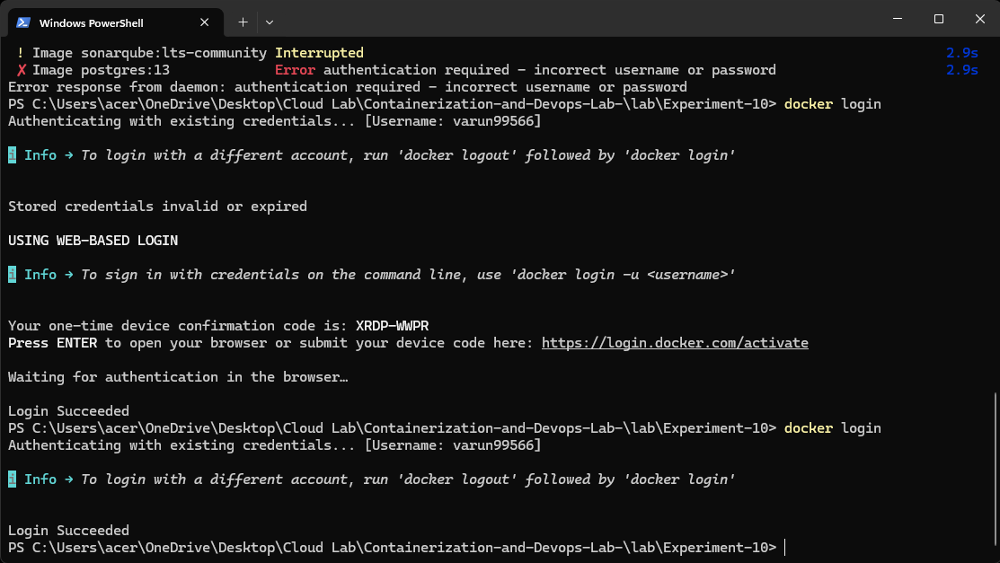

---

**Step 6 – Start SonarQube and PostgreSQL Successfully**  
Now `docker compose up -d` pulls both images and creates the containers.

```powershell
docker-compose up -d
```
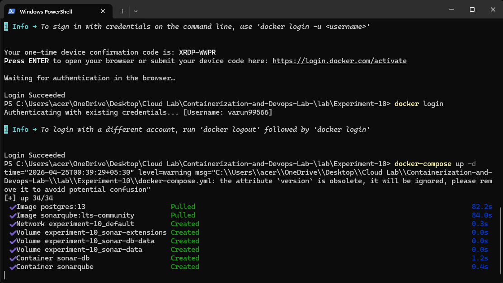

---

**Step 7 – Verify SonarQube is Operational**  
Check the logs of the `sonarqube` container until you see `SonarQube is operational`.

```powershell
docker compose logs -f sonarqube
```
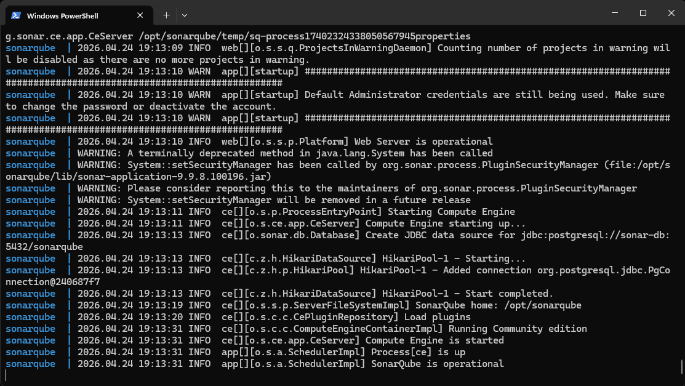

---

**Step 8 – Access the Web Dashboard**  
Open `http://localhost:9000` in a browser. The default credentials are `admin` / `admin`.

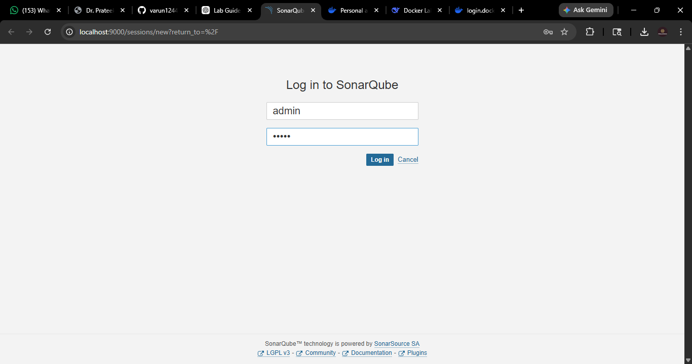

---

**Step 9 – Create a New Project Manually**  
After login, choose **Create a project manually**. Give it a project key (e.g., `sample-java-app`) and a display name.


---

**Step 10 – Generate an Authentication Token**  
Tokens are used by the scanner instead of passwords.  
1. Click your user icon → **My Account** → **Security**  
2. Under **Generate Tokens**, enter `scanner-token` and click Generate  
3. **Copy the token immediately** – it is shown only once.

*(The token looks like `sqa_...` and will be used in the next steps.)*

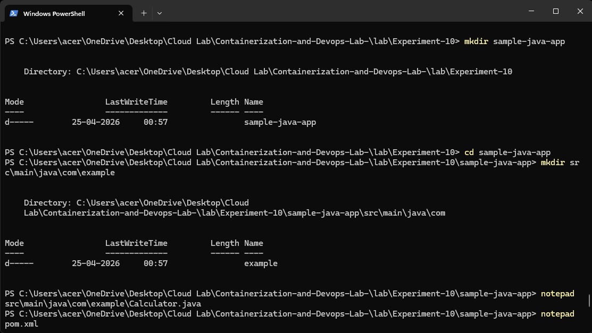

---

**Step 11 – Write the Sample Java Application with Intentional Flaws**  
Navigate to the experiment directory and create the Maven project structure and source file.

```powershell
mkdir -p sample-java-app\src\main\java\com\example
cd sample-java-app
notepad src\main\java\com\example\Calculator.java
```

**Calculator.java** (bugs, vulnerabilities, code smells):

```java
package com.example;

public class Calculator {

    // BUG: division by zero not handled
    public int divide(int a, int b) {
        return a / b;
    }

    // CODE SMELL: unused variable
    public int add(int a, int b) {
        int result = a + b;
        int unused = 100;  // never used
        return result;
    }

    // VULNERABILITY: SQL Injection
    public String getUser(String userId) {
        String query = "SELECT * FROM users WHERE id = '" + userId + "'";
        return query;
    }

    // DUPLICATED CODE: two identical methods
    public int multiply(int a, int b) {
        int result = 0;
        for (int i = 0; i < b; i++) {
            result = result + a;
        }
        return result;
    }

    public int multiplyAlt(int a, int b) {
        int result = 0;
        for (int i = 0; i < b; i++) {
            result = result + a;  // duplicate
        }
        return result;
    }

    // BUG: NullPointerException risk
    public String getName(String name) {
        return name.toUpperCase();
    }
}
```
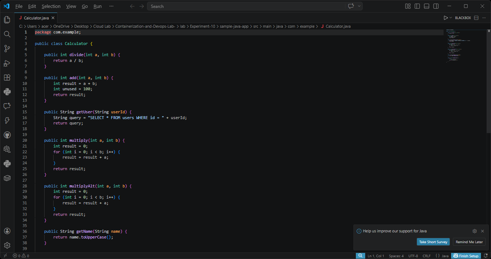

Also create `pom.xml` with Maven and SonarQube plugin configuration (make sure to replace `YOUR_TOKEN_HERE` with the actual token later):

```xml
<?xml version="1.0" encoding="UTF-8"?>
<project xmlns="http://maven.apache.org/POM/4.0.0"
         xmlns:xsi="http://www.w3.org/2001/XMLSchema-instance"
         xsi:schemaLocation="http://maven.apache.org/POM/4.0.0
         http://maven.apache.org/xsd/maven-4.0.0.xsd">
    <modelVersion>4.0.0</modelVersion>

    <groupId>com.example</groupId>
    <artifactId>sample-app</artifactId>
    <version>1.0-SNAPSHOT</version>

    <properties>
        <maven.compiler.source>11</maven.compiler.source>
        <maven.compiler.target>11</maven.compiler.target>
        <sonar.projectKey>sample-java-app</sonar.projectKey>
        <sonar.host.url>http://localhost:9000</sonar.host.url>
        <sonar.login>YOUR_TOKEN_HERE</sonar.login>
    </properties>

    <dependencies>
        <dependency>
            <groupId>junit</groupId>
            <artifactId>junit</artifactId>
            <version>4.13.2</version>
            <scope>test</scope>
        </dependency>
    </dependencies>

    <build>
        <plugins>
            <plugin>
                <groupId>org.sonarsource.scanner.maven</groupId>
                <artifactId>sonar-maven-plugin</artifactId>
                <version>3.9.1.2184</version>
            </plugin>
        </plugins>
    </build>
</project>
```

---

**Step 12 – Run the Scanner (First Attempt – Authentication Failure)**  
Without the correct token, the Maven plugin cannot authenticate to the SonarQube server.

```powershell
mvn sonar:sonar -Dsonar.login=wrong-token
```
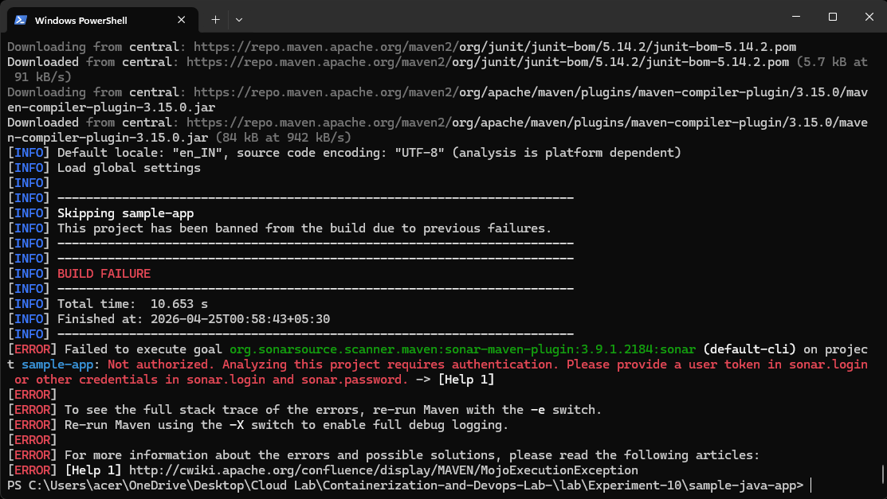

---

**Step 13 – Provide the Correct Token and Scan Successfully**  
Replace `YOUR_TOKEN_HERE` in `pom.xml` with the token generated in Step 10, or pass it via command line.

```powershell
mvn sonar:sonar -Dsonar.login=<your-copied-token>
```
Now the scan completes and the results are sent to the SonarQube server.

---

**Step 14 – View the Analysis Dashboard**  
Open `http://localhost:9000/dashboard?id=sample-java-app`.  
The dashboard shows:

- **Bugs** (e.g., division by zero)  
- **Vulnerabilities** (SQL injection)  
- **Code Smells** (unused variable, duplicated blocks)  
- **Quality Gate status** (FAILED because of the critical issues)

You can click on each number to see the exact line and a description.

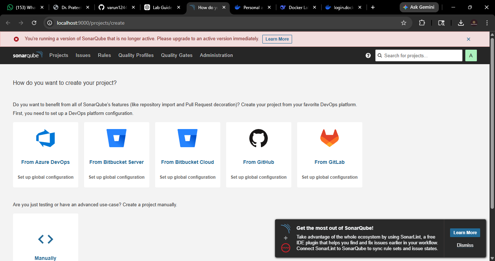

<hr>

### 🔍 Key Concepts

- **SonarQube Server** – The central analysis engine and web UI; stores all results.
- **Sonar Scanner** – A command‑line tool (or Maven/Gradle plugin) that reads source code and sends reports to the server.
- **Token** – An authentication string generated in the SonarQube UI; used by the scanner instead of a password.
- **Quality Gate** – A set of pass/fail rules; prevents code that fails to meet standards from being deployed.
- **Static Analysis** – Examining code without executing it to find bugs, vulnerabilities, and maintainability issues.

### 📘 Observations

- Docker Hub login was required because the images are pulled from a private or rate‑limited registry (or previous credentials expired).
- The first scan failed due to missing token – the scanner needs explicit authentication.
- The sample code contained realistic issues: unhandled exception, SQL injection, code duplication, and a null pointer risk.
- SonarQube identifies these issues and presents them in a structured, actionable format.

### 🛠️ Integration with CI/CD

The Jenkins pipeline (from Experiment 7) can be extended with a **SonarQube Analysis** stage:
- After checkout, `mvn clean verify sonar:sonar` runs the scanner.
- The **Quality Gate** stage waits for the SonarQube server to return a pass/fail decision.
- If the gate fails, the pipeline aborts, preventing the broken code from being built or deployed.

> **Note:** Always store the SonarQube token in Jenkins credentials (e.g., a “Secret text” credential) and inject it via `withSonarQubeEnv` or environment variables. Never hardcode tokens in source files.

### ✅ Result

Successfully deployed a SonarQube server using Docker Compose, scanned a faulty Java application, observed identified issues, and understood how Quality Gates act as a safety net in the software delivery process.
```