Below are the **README.md** and **index.html** for Experiment 12.  
Place both files inside `lab/Experiment-12/` (next to your `Images` folder and the YAML files).  
The `index.html` will automatically load and beautifully render the README – no changes to the parent homepage needed.

---

### 📄 `lab/Experiment-12/README.md`

```markdown
# Experiment 12: Study and Analyse Container Orchestration using Kubernetes

## Aim
To understand core Kubernetes concepts by deploying a WordPress application, exposing it with a Service, scaling the deployment, and observing self‑healing behaviour on a local cluster.

## Pre‑requisites
- Docker Desktop with Kubernetes enabled (or any running Kubernetes cluster)
- `kubectl` configured and working
- Basic YAML knowledge

---

## Step‑by‑Step Procedure

**Step 1 – Verify kubectl and Cluster Nodes**  
Check that `kubectl` is available and that the local Docker Desktop node is ready.

```powershell
kubectl version
kubectl get nodes
```
*The node `docker-desktop` appears as **Ready**, control-plane.*

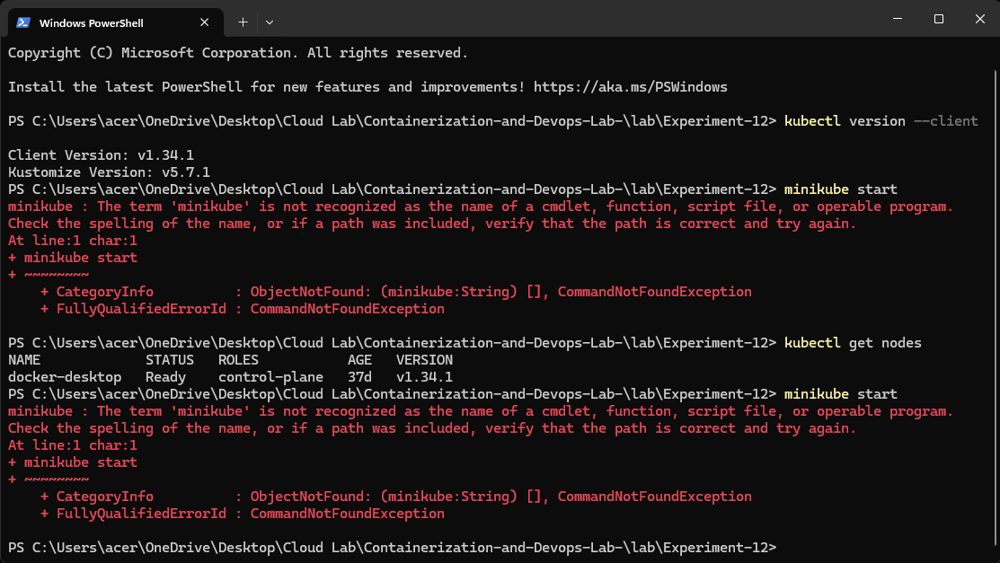

---

**Step 2 – Create the WordPress Deployment YAML**  
Write a deployment manifest that requests **2 replicas** of the WordPress container.

`wordpress-deployment.yaml`:
```yaml
apiVersion: apps/v1
kind: Deployment
metadata:
  name: wordpress
spec:
  replicas: 2
  selector:
    matchLabels:
      app: wordpress
  template:
    metadata:
      labels:
        app: wordpress
    spec:
      containers:
        - name: wordpress
          image: wordpress:latest
          ports:
            - containerPort: 80
```

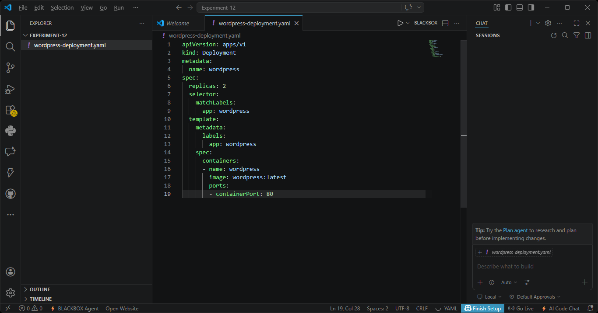

---

**Step 3 – Apply the Deployment**  
Submit the deployment to Kubernetes and list the resulting pods.

```powershell
kubectl apply -f wordpress-deployment.yaml
kubectl get pods
```
*Two WordPress pods are created (one may show **ContainerCreating** briefly).*

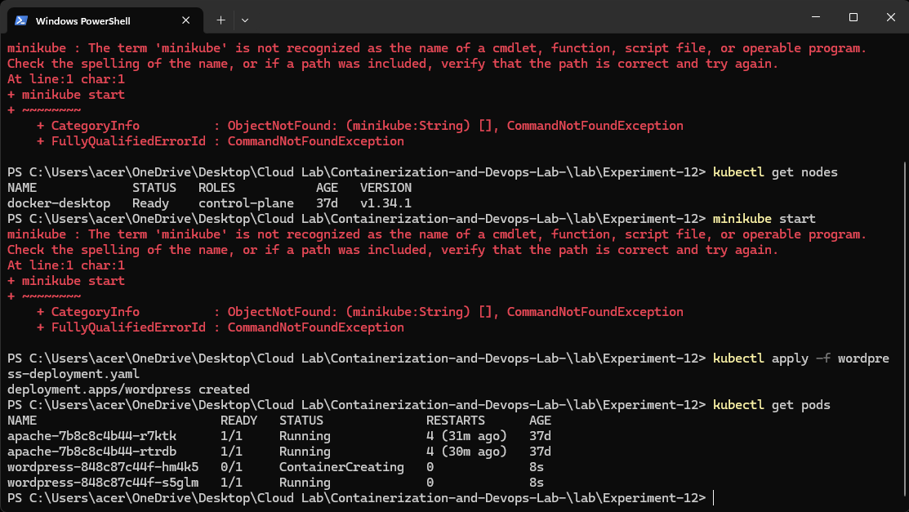

---

**Step 4 – Wait for All Pods to Become Ready**  
After a few seconds, both pods should be in **Running** state.

```powershell
kubectl get pods
```
*Both WordPress pods are **1/1 Running**.*

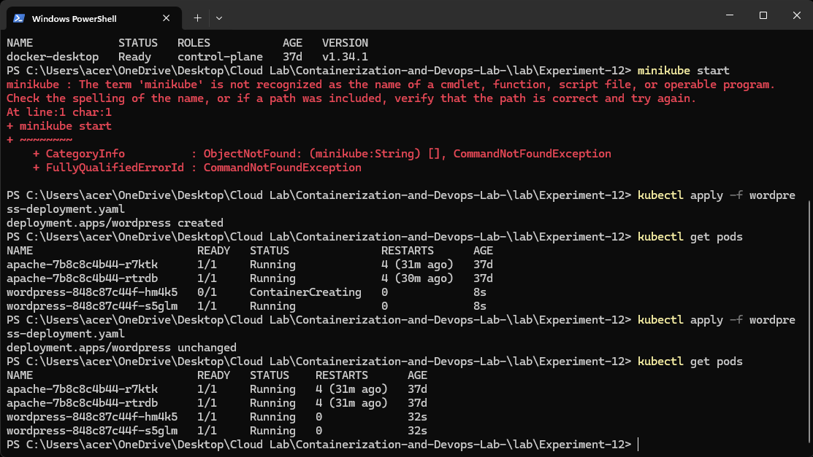

---

**Step 5 – Create the WordPress Service YAML**  
Define a `NodePort` Service to expose the deployment externally on port **30007**.

`wordpress-service.yaml`:
```yaml
apiVersion: v1
kind: Service
metadata:
  name: wordpress-service
spec:
  type: NodePort
  selector:
    app: wordpress
  ports:
    - port: 80
      targetPort: 80
      nodePort: 30007
```

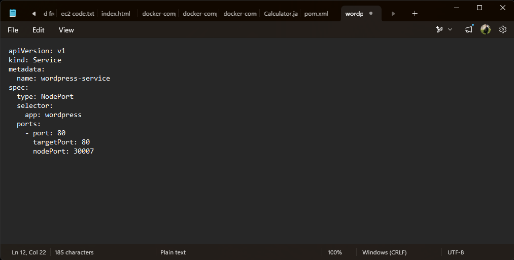

---

**Step 6 – Apply the Service**  
Create the service and then list all services.

```powershell
kubectl apply -f wordpress-service.yaml
kubectl get svc
```
*The new **wordpress-service** appears with type **NodePort** and port mapping **80:30007/TCP**.*

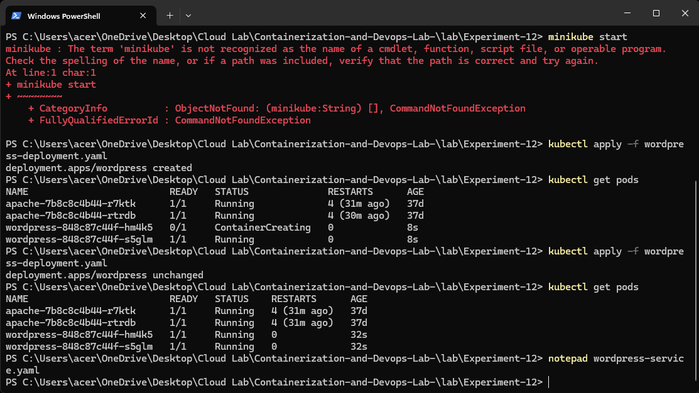  
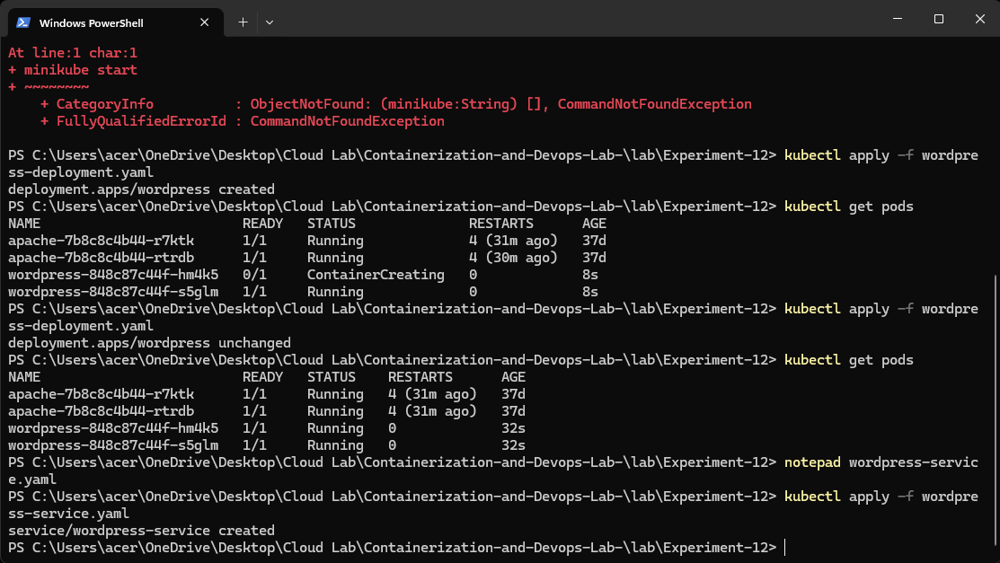

---

**Step 7 – Access WordPress in Browser**  
Open a browser and navigate to `http://localhost:30007`.  
*The WordPress language selection screen appears, confirming the application is reachable.*

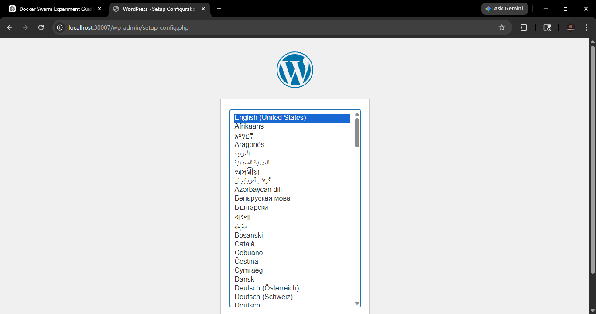

---

**Step 8 – Scale the Deployment**  
Increase the number of replicas from **2 to 4**.

```powershell
kubectl scale deployment wordpress --replicas=4
kubectl get pods
```
*Four pods are now listed – some may still be starting.*

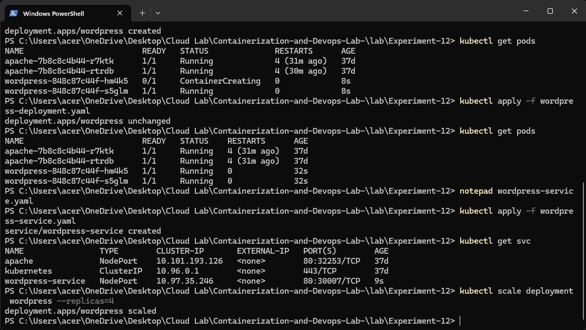

---

**Step 9 – Verify Scaling Completes**  
After a few moments, all four pods should be **Running**.

```powershell
kubectl get pods
```
*All replicas are **1/1 Running**.*

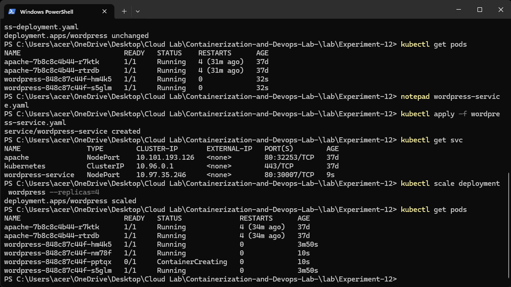

---

**Step 10 – Demonstrate Self‑Healing**  
Delete one pod manually and watch Kubernetes immediately recreate it.

```powershell
kubectl delete pod wordpress-84b8c87c44f-hm4k5
kubectl get pods
```
*A new pod (with a different name) is automatically started, keeping the total at 4.*

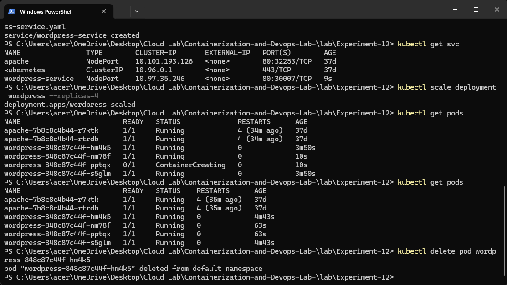  
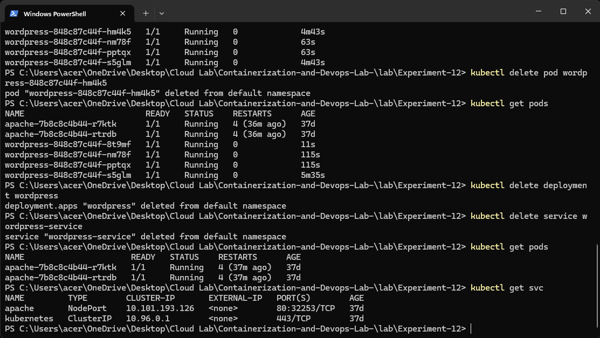

---

**Step 11 – Clean Up Resources**  
Remove the deployment and service.

```powershell
kubectl delete deployment wordpress
kubectl delete service wordpress-service
kubectl get pods
kubectl get svc
```
*Only the pre‑existing apache pods remain; WordPress resources are gone.*


---

## Key Concepts

| Kubernetes Object | Role |
|-------------------|------|
| **Pod**           | The smallest deployable unit – one or more containers |
| **Deployment**    | Manages replicas and rolling updates |
| **Service**       | Provides a stable network identity and load balancing |
| **ReplicaSet**    | Ensures a specified number of pod replicas are running at all times |
| **NodePort**      | Exposes a service on a static port of each node’s IP |

## Observations
- **Minikube** was not installed; Docker Desktop’s built‑in Kubernetes was used instead.
- Scaling from 2 to 4 replicas took only one command.
- After deleting a pod, Kubernetes automatically recreated it – no manual restart required.
- A `NodePort` service made the application accessible via `localhost:30007` without port‑forwarding.
- The deployment ensured the desired state was always maintained.

## Cleanup (Optional)
If you wish to remove the previously deployed Apache resources:
```powershell
kubectl delete deployment apache
kubectl delete service apache
```

---
```

---

