```markdown
## Docker Lab – Experiment 6: Nginx Container & WordPress with Docker Compose

<hr>

<h4 align="center"> Pre‑requisite </h4>

> **Working Directory Structure**  
> All commands in this experiment are executed inside `C:\Users\acer` (the home directory).  
> The subfolder `html` holds the custom Nginx page, and `wp-compose` contains the WordPress stack.
>
> 

<hr>

**Step 1 – Verify Docker and Docker Compose installation**  
Check that Docker Engine and the Compose plugin are correctly installed and accessible from PowerShell.

```powershell
docker --version
docker compose version
```
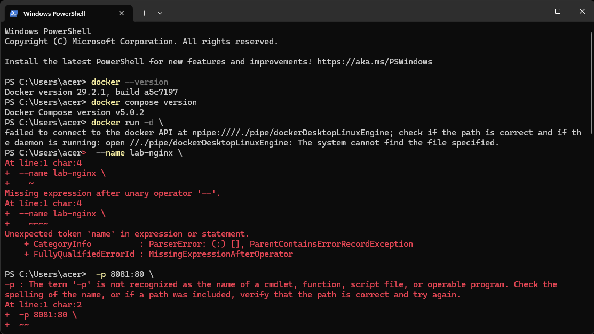

---

**Step 2 – First attempt to run a container (Docker daemon not running)**  
The first `docker run` fails because the Docker Desktop Linux engine is not running. The error message indicates the daemon is unreachable.

```powershell
docker run -d --name lab-nginx -p 8081:80 -v ${PWD}/html:/usr/share/nginx/html nginx:alpine
```
*(Error shown in the lower part of the screenshot)*


---

**Step 3 – Start Docker Desktop and run the Nginx container**  
After starting Docker Desktop, the same command pulls the `nginx:alpine` image and launches a container named `lab-nginx`.

```powershell
docker run -d --name lab-nginx -p 8081:80 -v ${PWD}/html:/usr/share/nginx/html nginx:alpine
```
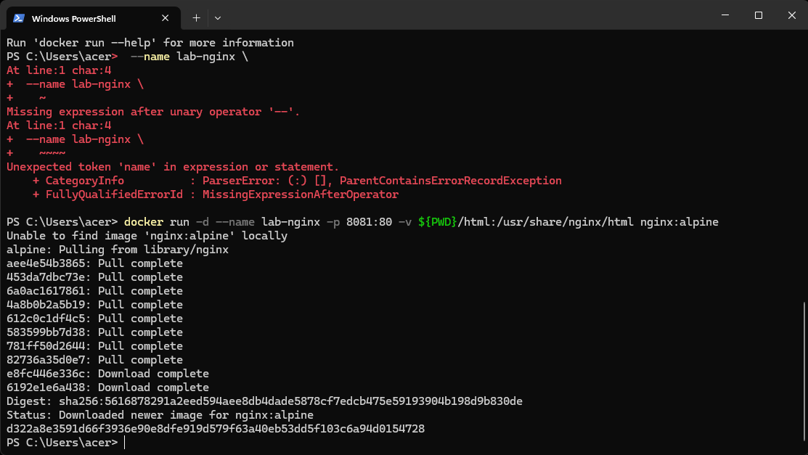

---

**Step 4 – Inspect running containers**  
List all running containers with `docker ps`. The output shows the `lab-nginx` container, its port mapping, and its name.

```powershell
docker ps
```
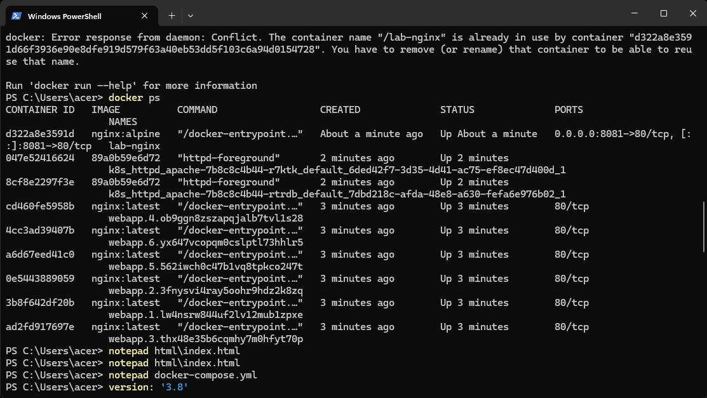

---

**Step 5 – Edit the default web page**  
Open the `index.html` file inside the `html` folder with Notepad to customise the Nginx welcome page.

```powershell
notepad html\index.html
```


---

**Step 6 – Write a Docker Compose file for Nginx (first attempt)**  
Trying to type the YAML content directly into the PowerShell terminal causes syntax errors because PowerShell interprets the dashes and colons as invalid commands.

```yaml
version: '3.8'
services:
  nginx:
    image: nginx:alpine
    container_name: lab-nginx-compose
    ports:
      - "8081:80"
    volumes:
      - ./html:/usr/share/nginx/html
```
*PowerShell errors appear in the screenshots: `version: '3.8'` is not recognised, and similar issues for `services:`, `ports:`, and `volumes:`.*

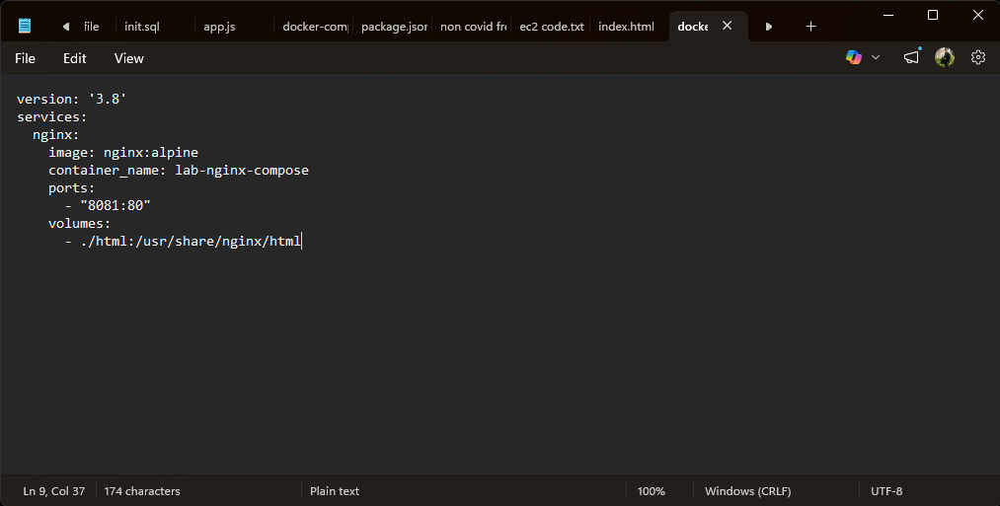
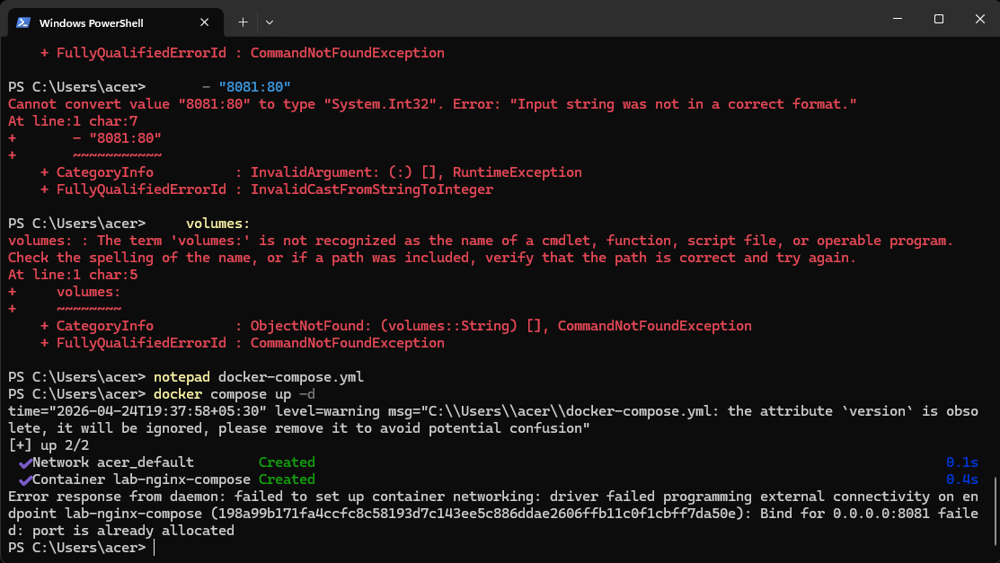

---

**Step 7 – Create the Compose file correctly with a text editor**  
Use Notepad to write the `docker-compose.yml` file. This avoids shell interpretation problems.

```powershell
notepad docker-compose.yml
```
The correct content (shown in the editor) is saved and then used with `docker compose`.

  *(the Notepad screenshot)*
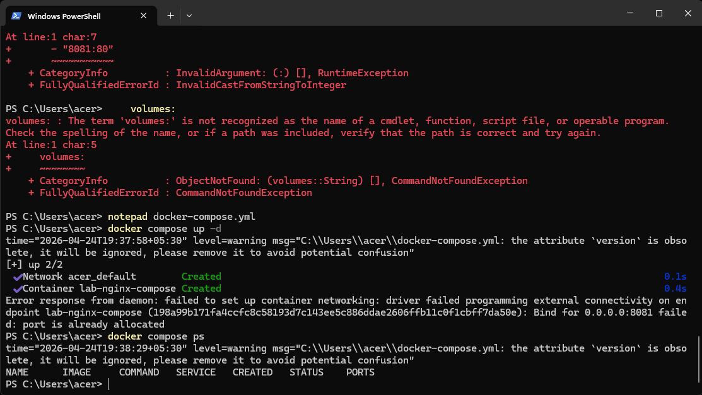

---

**Step 8 – Attempt to start the Nginx service with Compose**  
When running `docker compose up -d`, the container `lab-nginx-compose` is created but fails because port `8081` is already occupied by the manually started `lab-nginx` container.

```powershell
docker compose up -d
```


---

**Step 9 – Remove the conflicting container and restart the Compose stack**  
Stop and remove the old `lab-nginx` container, then run Compose again. This time the service starts successfully.

```powershell
docker rm -f lab-nginx
docker compose up -d
```
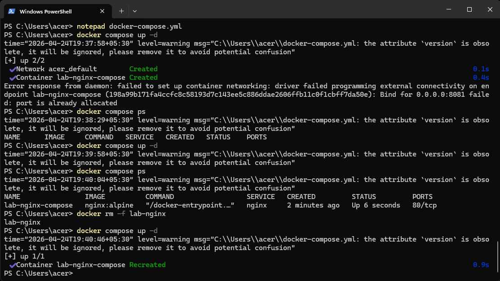

---

**Step 10 – Verify the Compose services**  
Check that the Compose‑managed Nginx container is running.

```powershell
docker compose ps
```
  *(later part)*

---

**Step 11 – Prepare the WordPress project**  
Create a new directory `wp-compose`, navigate into it, and create a fresh `docker-compose.yml` for WordPress.

```powershell
mkdir wp-compose
cd wp-compose
notepad docker-compose.yml
```
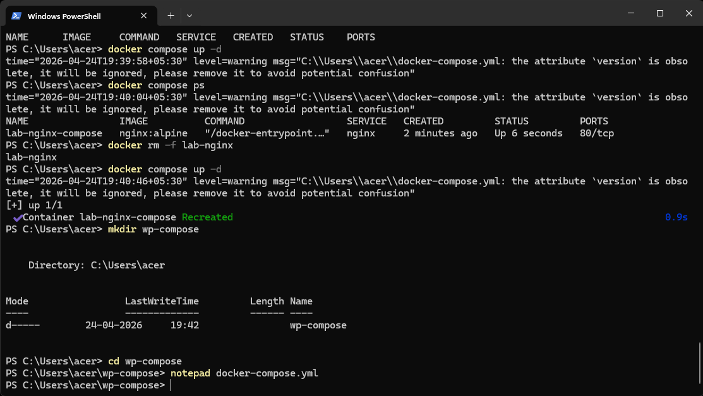

---

**Step 12 – Define the WordPress and MySQL services**  
The Compose file defines a MySQL 5.7 database and a latest WordPress image. It sets environment variables for credentials and creates named volumes for data persistence.

```yaml
services:
  db:
    image: mysql:5.7
    container_name: wordpress_db
    restart: always
    environment:
      MYSQL_ROOT_PASSWORD: rootpass
      MYSQL_DATABASE: wordpress
      MYSQL_USER: wpuser
      MYSQL_PASSWORD: wppass
    volumes:
      - db_data:/var/lib/mysql

  wordpress:
    image: wordpress:latest
    container_name: wordpress_app
    depends_on:
      - db
    ports:
      - "8082:80"
    restart: always
    environment:
      WORDPRESS_DB_HOST: db:3306
      WORDPRESS_DB_USER: wpuser
      WORDPRESS_DB_PASSWORD: wppass
      WORDPRESS_DB_NAME: wordpress
    volumes:
      - wp_data:/var/www/html

volumes:
  db_data:
  wp_data:
```
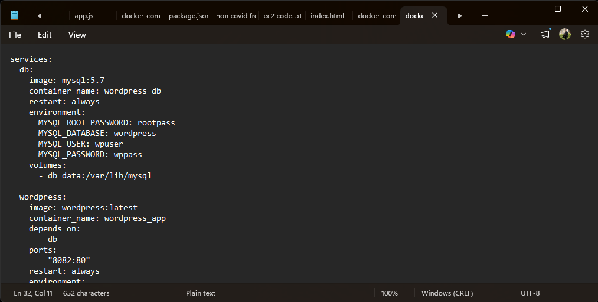

---

**Step 13 – Pull images and launch the WordPress stack**  
`docker compose up -d` downloads the required images (MySQL 5.7, WordPress latest) and starts both containers.

```powershell
docker compose up -d
```
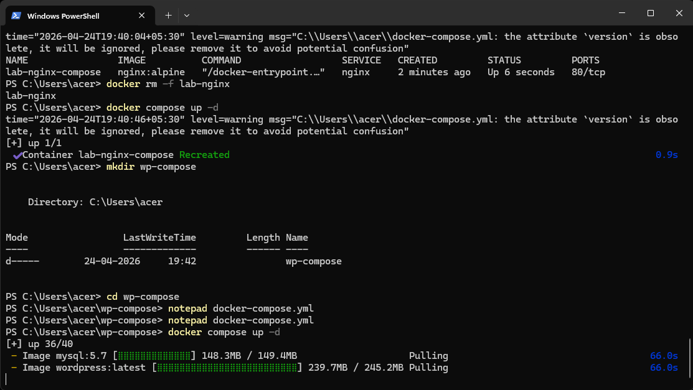
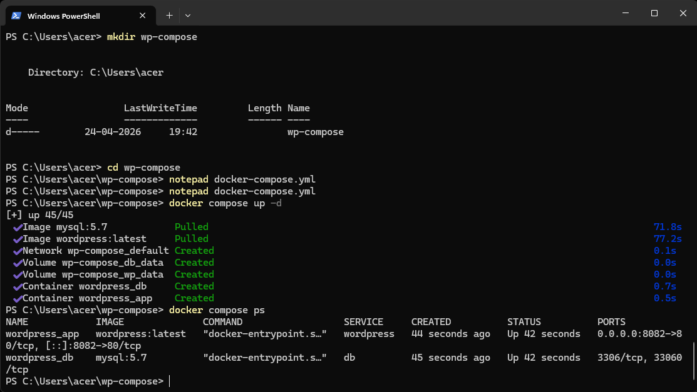

---

**Step 14 – Confirm the WordPress stack is running**  
Check the status of the Compose project. Both `wordpress_db` and `wordpress_app` are listed with their respective ports.

```powershell
docker compose ps
```


---

**Step 15 – Access the WordPress installation wizard**  
Open a browser and navigate to `http://localhost:8082`. You are greeted with the WordPress language selection page, indicating the site is ready for configuration.

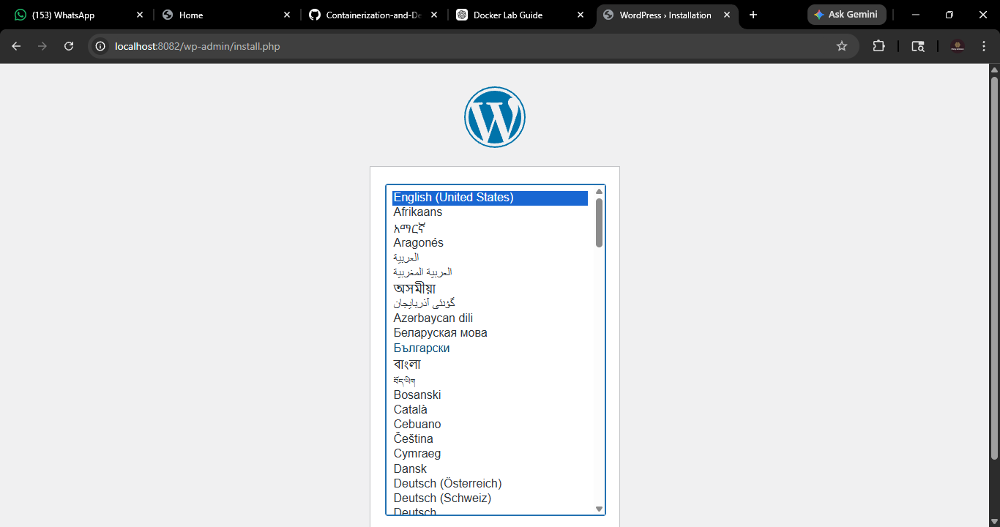

---

## 📘 Additional Notes

- **Port conflicts**: Always ensure a port is not already bound before starting a new service. Use `docker ps` and `docker rm -f <container>` to resolve conflicts.
- **PowerShell vs YAML**: YAML content must be written to a file using a text editor. Pasting it directly into PowerShell will cause parsing errors.
- **Compose version warning**: The `version` attribute in `docker-compose.yml` is obsolete (as shown by the Compose messages). It can be safely removed from the file.
- **Data persistence**: Named volumes (`db_data`, `wp_data`) keep database and website files safe even if containers are removed.
```