```markdown
## Lab Experiment 9: Ansible – Configuration Management with Docker Containers

### Aim
To demonstrate infrastructure automation using Ansible. A control node (WSL Ubuntu) manages four Docker-based Ubuntu server containers without installing any agents, using SSH and YAML playbooks.

<hr>

<h4 align="center"> Pre‑requisite </h4>

- Ubuntu environment (WSL) on Windows
- Docker installed and running (Docker Desktop)
- Basic Linux and SSH knowledge
- Python 3 and pip (available inside WSL)

> **Experiment Directory Structure**  
> All files (Dockerfile, inventory, playbook, SSH keys) are kept in the same working directory.
>
> 

<hr>

### Step‑by‑Step Procedure

---

**Step 1 – Install Ansible via `apt`**  
Update package lists and install Ansible from the official Ubuntu repositories.

```bash
sudo apt update -y
sudo apt install ansible -y
```
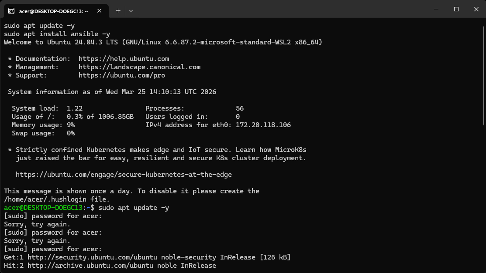  
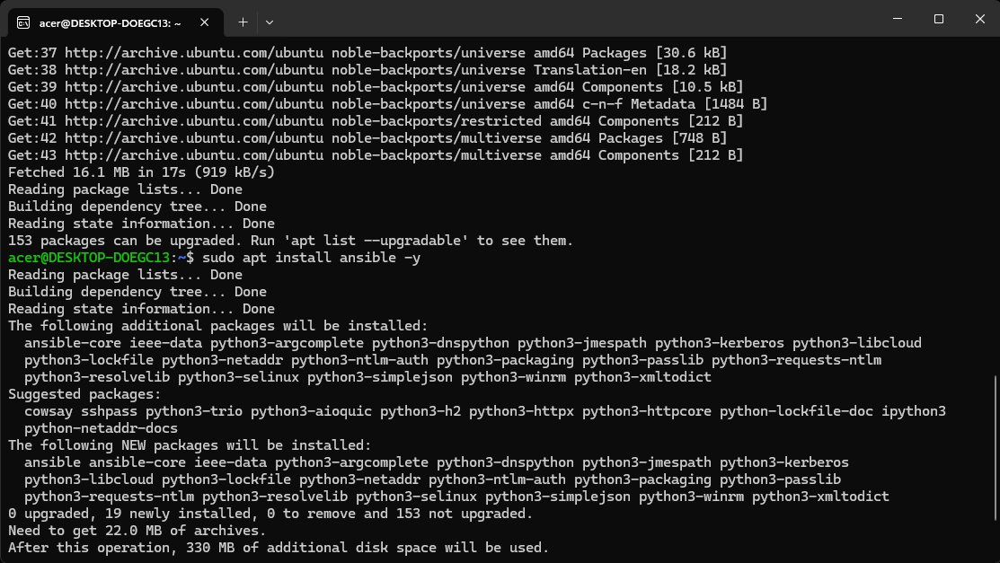

---

**Step 2 – Verify Ansible Installation**  
Check the installed version and test the local connection with the `ping` module.

```bash
ansible --version
ansible localhost -m ping
```
Expected output: `"ping": "pong"`

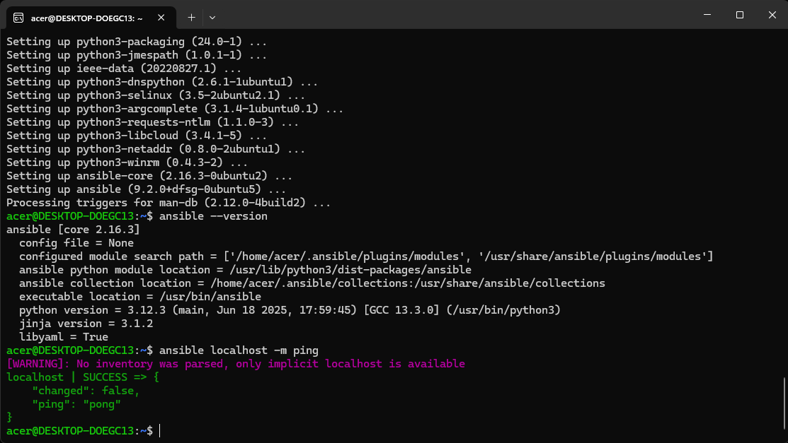

---

**Step 3 – Generate an SSH Key Pair**  
Create an RSA 4096‑bit key pair. This key will be used to authenticate to the managed containers without a password.

```bash
rm -rf ~/.ssh
mkdir ~/.ssh
chmod 700 ~/.ssh
ssh-keygen -t rsa -b 4096
```
*(Accept default file location and leave passphrase empty for this lab.)*

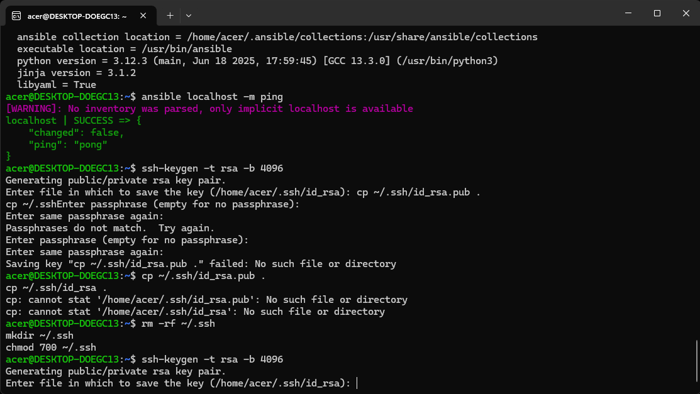  
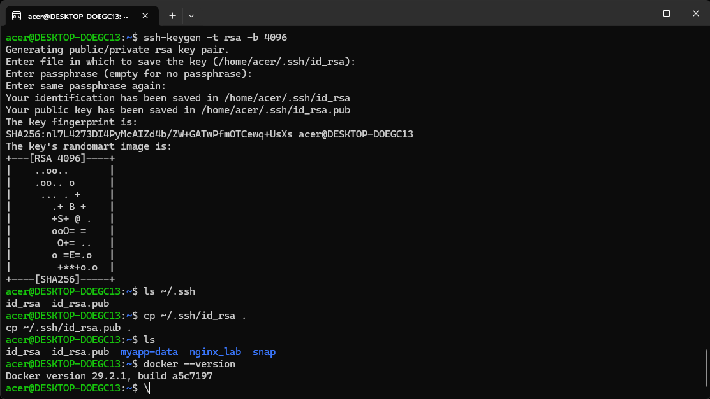

---

**Step 4 – Copy Keys to Working Directory and Verify Docker**  
Copy the newly generated keys into the current directory. They will be baked into the Docker image. Also confirm that Docker is accessible.

```bash
cp ~/.ssh/id_rsa .
cp ~/.ssh/id_rsa.pub .
docker --version
```
*(If Docker is not installed in WSL, install it with `sudo apt install docker.io -y`.)*

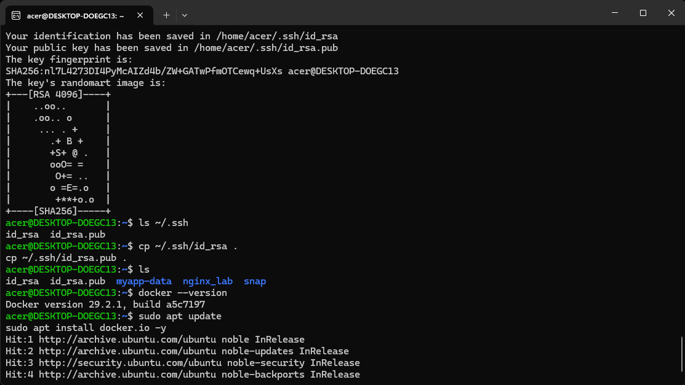

---

**Step 5 – Create a Dockerfile for an SSH‑enabled Ubuntu Image**  
Write a `Dockerfile` that:
- Starts from the official Ubuntu image
- Installs Python 3, OpenSSH server
- Configures SSH to allow root login with key authentication only
- Copies the private key and public key into the container

```dockerfile
FROM ubuntu

RUN apt update -y
RUN apt install -y python3 python3-pip openssh-server

RUN mkdir -p /var/run/sshd

RUN mkdir -p /run/sshd && \
    echo 'root:password' | chpasswd && \
    sed -i 's/#PermitRootLogin prohibit-password/PermitRootLogin yes/' /etc/ssh/sshd_config && \
    sed -i 's/#PasswordAuthentication yes/PasswordAuthentication no/' /etc/ssh/sshd_config && \
    sed -i 's/#PubkeyAuthentication yes/PubkeyAuthentication yes/' /etc/ssh/sshd_config

RUN mkdir -p /root/.ssh && chmod 700 /root/.ssh

COPY id_rsa /root/.ssh/id_rsa
COPY id_rsa.pub /root/.ssh/authorized_keys

RUN chmod 600 /root/.ssh/id_rsa && \
    chmod 644 /root/.ssh/authorized_keys

EXPOSE 22

CMD ["/usr/sbin/sshd", "-D"]
```

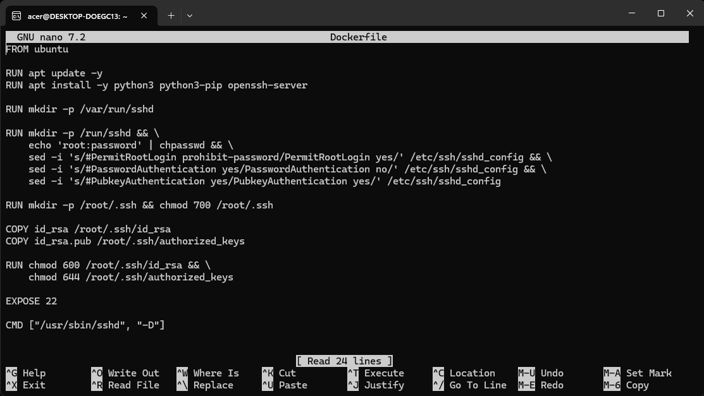

---

**Step 6 – Build the Docker Image**  
Tag the image as `ubuntu-server`.

```bash
docker build -t ubuntu-server .
```

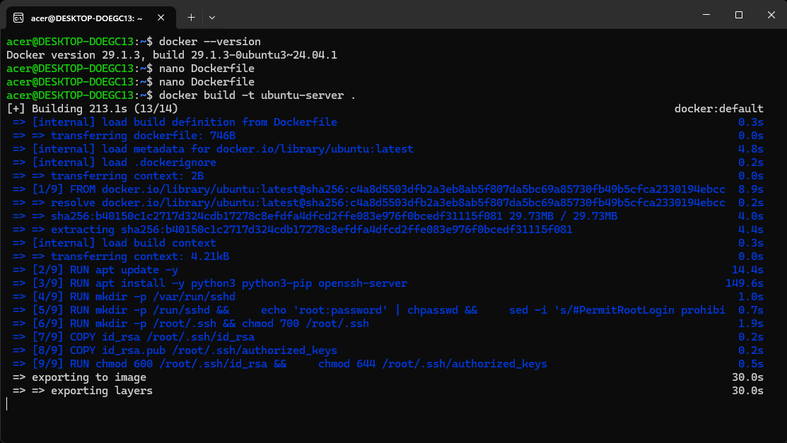

---

**Step 7 – Run Four Server Containers**  
Launch four containers (`server1` to `server4`) with port mappings from host ports 2201‑2204 to container port 22.

```bash
for i in {1..4}; do
    docker run -d -p 220${i}:22 --name server${i} ubuntu-server
done
```

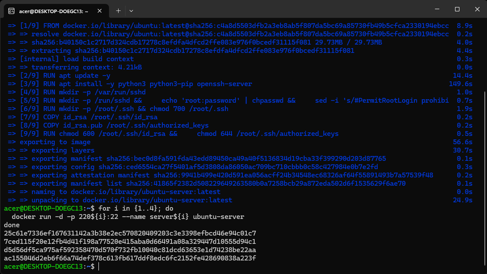

---

**Step 8 – Verify Running Containers**  
List all active Docker containers.

```bash
docker ps
```

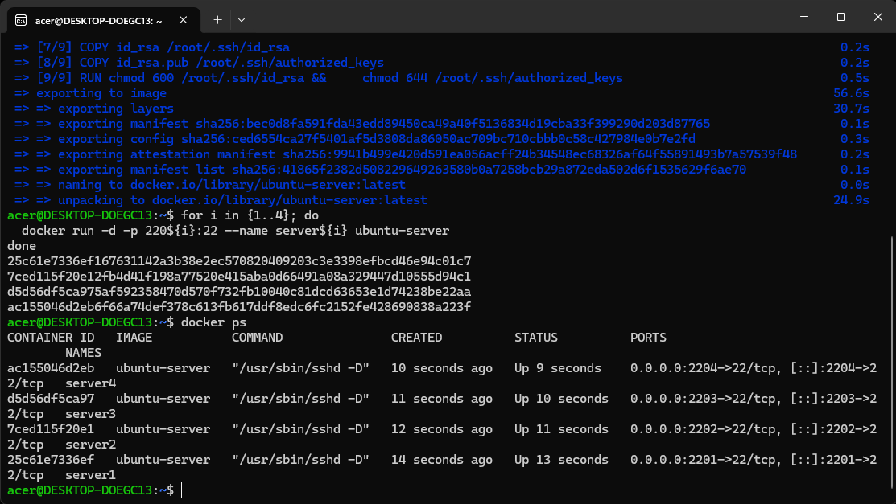

---

**Step 9 – Test Password‑Based SSH Login**  
Connect to `server1` on port 2201 using the root password `password`. This confirms the SSH server is running.

```bash
ssh root@localhost -p 2201
# When prompted, enter password: password
```

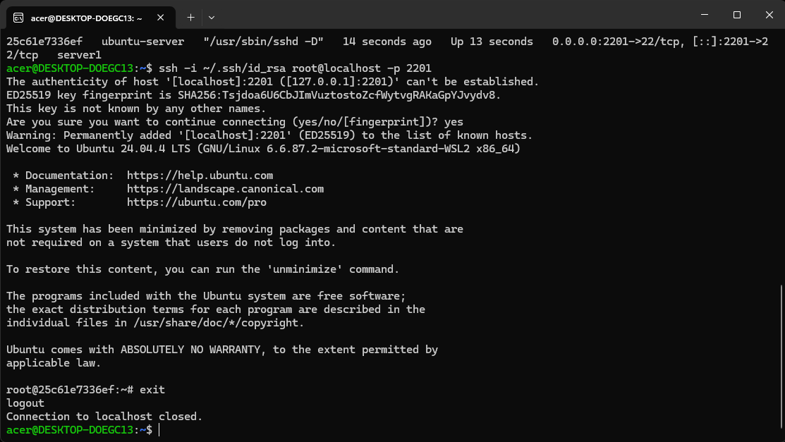

---

**Step 10 – Create the Ansible Inventory File**  
Define the four servers using their localhost‑mapped ports and the private key for authentication.

```ini
[servers]
server1 ansible_host=localhost ansible_port=2201
server2 ansible_host=localhost ansible_port=2202
server3 ansible_host=localhost ansible_port=2203
server4 ansible_host=localhost ansible_port=2204

[servers:vars]
ansible_user=root
ansible_ssh_private_key_file=~/.ssh/id_rsa
ansible_python_interpreter=/usr/bin/python3
```

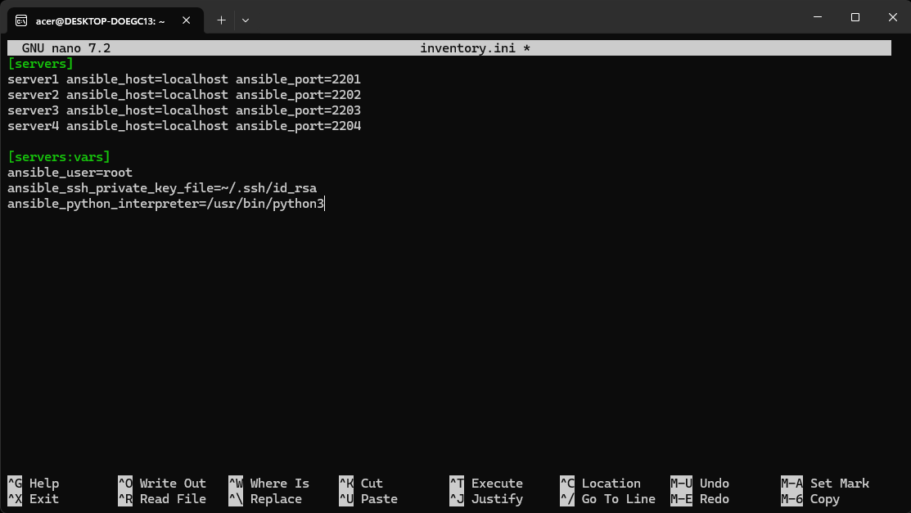

---

**Step 11 – Test Key‑Based SSH Authentication**  
Use the private key to log in without a password. If host key verification prompts appear, type `yes` to add the host.

```bash
ssh -i ~/.ssh/id_rsa root@localhost -p 2201
```

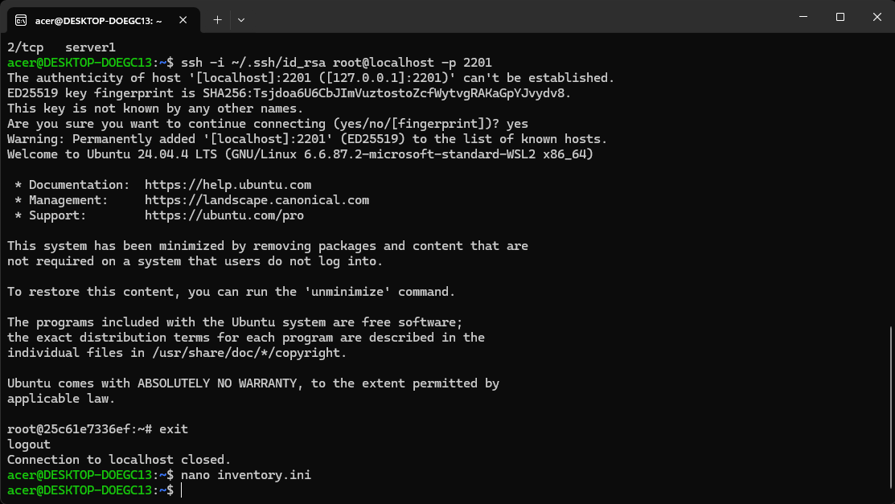

---

**Step 12 – Run Ansible Ping Test**  
Use the `ping` module to check connectivity to all managed nodes.

```bash
ansible all -i inventory.ini -m ping
```
*(Answer `yes` when prompted to accept SSH host keys.)*

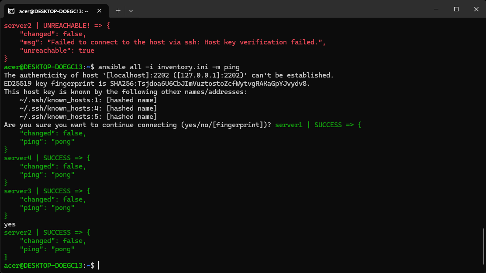  
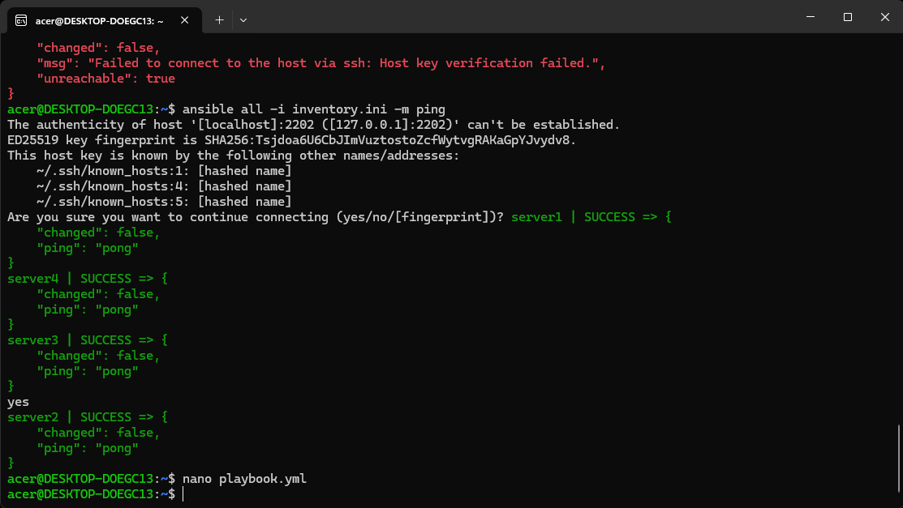

---

**Step 13 – Write an Ansible Playbook**  
Create `playbook.yml` to update apt cache, install `vim`, `htop`, `wget`, and place a marker file on each server.

```yaml
---
- name: Configure servers
  hosts: all
  become: yes
  tasks:
    - name: Update apt package index
      apt:
        update_cache: yes

    - name: Install required packages
      apt:
        name:
          - vim
          - htop
          - wget
        state: present

    - name: Create test file
      copy:
        dest: /root/ansible_test.txt
        content: "Configured by Ansible on {{ inventory_hostname }}"
```

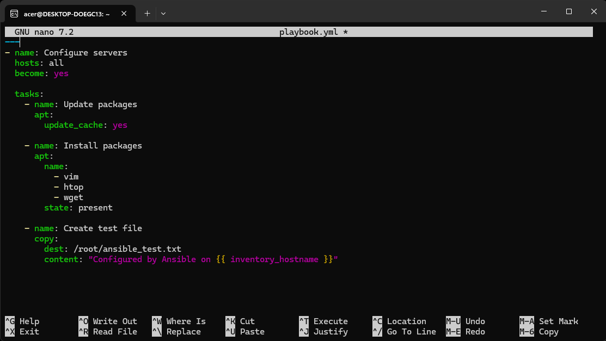

---

**Step 14 – Execute the Playbook**  
Run the playbook against the inventory.

```bash
ansible-playbook -i inventory.ini playbook.yml
```

---

**Step 15 – Verify the Configuration**  
Check the content of the test file on every server using the Ansible `command` module.

```bash
ansible all -i inventory.ini -m command -a "cat /root/ansible_test.txt"
```

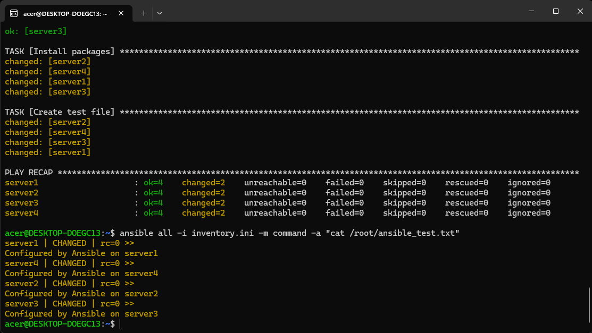

---

**Step 16 – Clean Up (Optional)**  
Stop and remove the containers when finished.

```bash
for i in {1..4}; do docker rm -f server${i}; done
```

<hr>

### 📘 Key Concepts

- **Agentless**: No software installed on managed nodes – Ansible uses SSH.
- **Idempotency**: Running the playbook multiple times yields the same desired state.
- **Inventory**: A simple file listing target hosts and their connection details.
- **Playbook**: YAML‑based definition of desired configuration.
- **Modules**: Pre‑built units of work (e.g., `apt`, `copy`, `command`) that Ansible executes.

### 🔍 Observations

- SSH key‑based authentication enables seamless, password‑less connections.
- Ansible’s declarative syntax keeps automation readable and repeatable.
- Using Docker containers as targets provides a lightweight, disposable lab environment.
- Host key verification can be bypassed for testing, but in production it should be properly managed.

### 📝 References

- [Ansible Official Documentation](https://docs.ansible.com)
- [Ansible Tutorial – spacelift.io](https://spacelift.io/blog/ansible-tutorial)
```